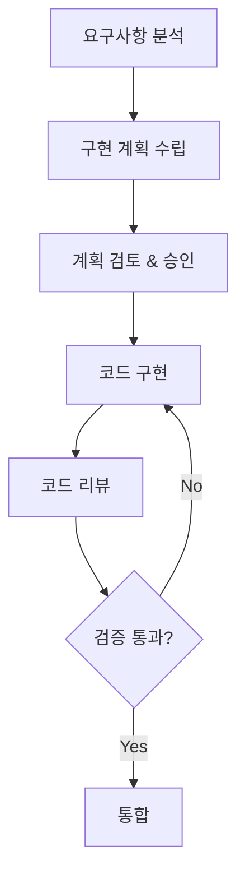
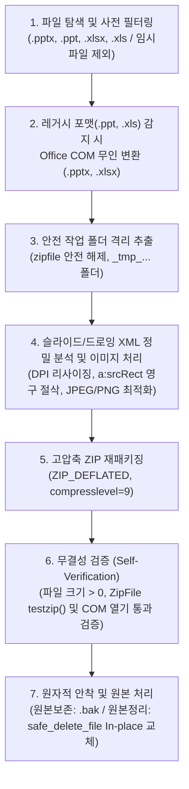

# 🚀 2026 AI 코딩 품질 최적화 가이드라인

> **버전**: v39.3.0 Hardening | **최종 업데이트**: 2026-09-18  
> **적용 대상**: React/JavaScript/TypeScript 기반 단일 파일 웹 애플리케이션 및 Python Office 자동화 (PowerPoint/Excel)  
> **참조 표준**: NIST AI RMF, ISO/IEC 42001, EU AI Act, Anthropic CLAUDE.md

---

## 📋 목차

1. [아키텍처 원칙](#1-아키텍처-원칙)
2. [클린 코드 원칙](#2-클린-코드-원칙)
3. [AI 협업 가이드라인](#3-ai-협업-가이드라인)
4. [React/JavaScript 스타일 가이드](#4-reactjavascript-스타일-가이드)
5. [보안 및 규정 준수](#5-보안-및-규정-준수)
6. [테스트 및 품질 보증](#6-테스트-및-품질-보증)
7. [문서화 표준](#7-문서화-표준)
8. [성능 최적화](#8-성능-최적화)
9. [Python Office 자동화 가이드](#9-python-office-automation-가이드-powerpoint-excel)
10. [초격차 안정성 심층 기술 분석](#10-초격차-안정성-심층-기술-분석)

---

## 1. 아키텍처 원칙

### 1.1 클린 레이어 아키텍처 (Clean Layer Architecture)

단일 파일 애플리케이션에서도 **4계층 분리**를 준수합니다:

```
┌─────────────────────────────────────────────────────────────┐
│ LAYER 4: FRAMEWORKS & UI (프레젠테이션)                      │
│ - React 컴포넌트, Custom Hooks, Context                     │
│ - 사용자 인터랙션 처리                                        │
├─────────────────────────────────────────────────────────────┤
│ LAYER 3: INTERFACE ADAPTERS (인터페이스 어댑터)              │
│ - Repository 패턴 (StorageRepository)                       │
│ - 외부 시스템 어댑터 (ExcelAdapter, HTMLExportAdapter)       │
├─────────────────────────────────────────────────────────────┤
│ LAYER 2: USE CASES (유스케이스)                              │
│ - 비즈니스 로직 함수                                         │
│ - 통계 계산, CRUD 오퍼레이션                                 │
├─────────────────────────────────────────────────────────────┤
│ LAYER 1: DOMAIN (도메인)                                     │
│ - 엔티티, 값 객체, 상수                                      │
│ - 팩토리 함수                                                │
└─────────────────────────────────────────────────────────────┘
```

### 1.2 의존성 규칙 (Dependency Rule)

```javascript
// ✅ 올바름: 상위 레이어가 하위 레이어에 의존
const App = () => {
    const data = StorageRepository.load();           // Layer 4 → Layer 3
    const stats = calculateStatistics(data);         // Layer 3 → Layer 2
    const formatted = Formatters.currency(stats.total); // Pure function
};

// ❌ 잘못됨: 하위 레이어가 상위 레이어에 의존
const calculateStatistics = () => {
    ReactDOM.render(...);  // Domain/UseCase가 UI에 의존하면 안됨
};
```

### 1.3 단일 책임 원칙 (SRP)

각 모듈/함수는 **하나의 책임**만 가집니다:

| 책임 | 담당 모듈 | 예시 |
|------|----------|------|
| 데이터 스키마 | Domain Constants | `DOMAIN_CONSTANTS`, `createNewItem()` |
| 비즈니스 로직 | Use Cases | `calculateStatistics()`, `ItemUseCases` |
| 외부 I/O | Adapters | `StorageRepository`, `ExcelAdapter` |
| UI 렌더링 | Components | `StatCard`, `PlanTable`, `AppHeader` |

---

## 2. 클린 코드 원칙

### 2.1 SOLID 원칙

| 원칙 | 설명 | 적용 예시 |
|------|------|----------|
| **S**ingle Responsibility | 한 클래스/함수는 하나의 이유로만 변경 | `calculateStatistics()`는 통계만 계산 |
| **O**pen/Closed | 확장에 열려있고, 수정에 닫혀있음 | 새 Adapter 추가로 기능 확장 |
| **L**iskov Substitution | 부모 타입 자리에 자식 타입 대체 가능 | Repository 인터페이스 |
| **I**nterface Segregation | 클라이언트에 필요한 인터페이스만 노출 | 필요한 handler만 props로 전달 |
| **D**ependency Inversion | 고수준 모듈이 저수준 모듈에 의존하지 않음 | UseCase가 Repository 인터페이스에 의존 |

### 2.2 DRY/KISS/YAGNI

```javascript
// ✅ DRY: 반복 로직 추출
const sumCost = (arr) => arr.reduce((acc, item) => acc + (Number(item.cost) || 0), 0);
const confirmedOnly = (arr) => arr.filter(i => i.confirmed);

// 재사용
const totalCost = sumCost(items);
const confirmedCost = sumCost(confirmedOnly(items));

// ✅ KISS: 단순하게 유지
const isInvestment = (item) => 
    item.category?.replace(/\s/g, '').includes('투자');

// ✅ YAGNI: 필요할 때만 구현
// 미래에 필요할 "것 같은" 기능은 구현하지 않음
```

### 2.3 네이밍 컨벤션

| 대상 | 규칙 | 예시 |
|------|------|------|
| React 컴포넌트 | PascalCase | `StatCard`, `PlanTable` |
| 함수/변수 | camelCase | `calculateStatistics`, `handleChange` |
| 상수 | SCREAMING_SNAKE_CASE | `DOMAIN_CONSTANTS`, `STORAGE_KEY` |
| 커스텀 훅 | use 접두사 | `usePlanData`, `useFileHandlers` |
| 불리언 변수 | is/has/can 접두사 | `isConfirmed`, `hasError` |
| 이벤트 핸들러 | handle/on 접두사 | `handleClick`, `onSubmit` |

### 2.4 함수 설계 원칙

```javascript
// ✅ 좋은 함수: 작고, 한 가지 일만, 명확한 이름
const toggleConfirm = (items, id) =>
    items.map(item => item.id === id 
        ? { ...item, confirmed: !item.confirmed } 
        : item
    );

// ❌ 나쁜 함수: 여러 일을 하고, 길고, 부작용 있음
const doEverything = (items, id) => {
    // 확정 토글
    // 통계 계산
    // 로컬스토리지 저장
    // 알림 표시
    // ... 200줄 이상
};
```

---

## 3. AI 협업 가이드라인

### 3.1 프롬프트 엔지니어링 원칙

```markdown
## 효과적인 AI 프롬프트 작성법

1. **명확한 컨텍스트 제공**
   - 현재 기술 스택 명시
   - 기존 코드 구조 설명
   - 원하는 동작 상세 기술

2. **작업 분할**
   - 큰 작업을 작은 단위로 분할
   - 단계별 접근 요청
   - 중간 결과 확인 후 진행

3. **제약 조건 명시**
   - 사용할 라이브러리 제한
   - 코딩 스타일 요구사항
   - 성능 목표
```

### 3.2 AI 생성 코드 검증 체크리스트

```markdown
□ 논리적 정확성 검증 (Hallucination 체크)
□ 아키텍처 정합성 확인
□ 보안 취약점 검토
□ 성능 영향 분석
□ 기존 코드와의 일관성
□ 테스트 커버리지 확인
□ 에지 케이스 처리
```

### 3.3 Plan-Then-Execute 워크플로우



---

## 4. React/JavaScript 스타일 가이드

### 4.1 컴포넌트 구조

```javascript
// ✅ 권장 컴포넌트 구조 (최대 150-200줄)
const ComponentName = ({ prop1, prop2 }) => {
    // 1. Hooks (useState, useEffect, useMemo...)
    const [state, setState] = useState(initialValue);
    
    // 2. Derived values / Computed
    const computedValue = useMemo(() => {
        return expensiveCalculation(state);
    }, [state]);
    
    // 3. Event handlers
    const handleClick = useCallback(() => {
        // 처리 로직
    }, [dependencies]);
    
    // 4. Effects
    useEffect(() => {
        // 부수 효과
        return () => { /* 정리 */ };
    }, [dependencies]);
    
    // 5. Render
    return (
        <div>
            {/* JSX */}
        </div>
    );
};
```

### 4.2 훅 사용 가이드

```javascript
// ✅ useState: 단순 상태
const [count, setCount] = useState(0);

// ✅ useReducer: 복잡한 상태 로직
const [state, dispatch] = useReducer(reducer, initialState);

// ✅ useMemo: 비용이 큰 계산 캐싱
const expensiveValue = useMemo(() => computeExpensive(a, b), [a, b]);

// ✅ useCallback: 함수 참조 안정화
const handleClick = useCallback(() => doSomething(id), [id]);

// ❌ 과도한 메모이제이션 지양
const simpleValue = useMemo(() => a + b, [a, b]); // 불필요
```

### 4.3 JSX 가독성

```jsx
// ✅ 조건부 렌더링: 명확한 패턴 사용
{isLoading && <Spinner />}
{error ? <Error message={error} /> : <Content data={data} />}

// ✅ 리스트 렌더링: key 필수
{items.map(item => (
    <Item key={item.id} {...item} />
))}

// ✅ 긴 props: 멀티라인 포맷
<Button
    variant="primary"
    size="large"
    onClick={handleClick}
    disabled={isDisabled}
>
    클릭
</Button>
```

---

## 5. 보안 및 규정 준수

### 5.1 보안 체크리스트

```markdown
## 필수 보안 검토 항목

### 입력 검증
□ 모든 사용자 입력 검증
□ XSS 공격 방지 (innerHTML 사용 금지)
□ SQL/NoSQL 인젝션 방지

### 데이터 보호
□ 민감 정보 암호화
□ 하드코딩된 비밀정보 없음
□ HTTPS 강제 사용

### 의존성 보안
□ 최신 보안 패치 적용
□ 알려진 취약점 없음
□ 라이선스 호환성 확인
```

### 5.2 규정 준수 (2026 기준)

| 규정 | 요구사항 | 적용 방법 |
|------|---------|----------|
| **EU AI Act** | 투명성, 고위험 AI 규칙 | AI 생성 코드 명시 |
| **NIST AI RMF** | 리스크 관리 프레임워크 | 코드 리뷰 프로세스 |
| **ISO/IEC 42001** | AI 관리 시스템 | 문서화, 추적성 |
| **GDPR** | 개인정보 보호 | 데이터 암호화, 동의 |

---

## 6. 테스트 및 품질 보증

### 6.1 테스트 피라미드

```
        ╱╲
       ╱  ╲        E2E 테스트 (10%)
      ╱────╲       - 사용자 플로우
     ╱      ╲      
    ╱────────╲     통합 테스트 (20%)
   ╱          ╲    - 컴포넌트 상호작용
  ╱────────────╲   
 ╱              ╲  단위 테스트 (70%)
╱────────────────╲ - 개별 함수/컴포넌트
```

### 6.2 AI 생성 코드 테스트 강화

```javascript
// AI 생성 코드에는 추가 테스트 필수
describe('AI Generated: calculateStatistics', () => {
    // 1. 기본 동작
    it('should calculate total cost correctly', () => {});
    
    // 2. 경계 조건
    it('should handle empty array', () => {});
    it('should handle negative costs', () => {});
    
    // 3. 실제 데이터 시뮬레이션
    it('should work with production-like data', () => {});
    
    // 4. 성능 테스트
    it('should complete within 100ms for 1000 items', () => {});
});
```

---

## 7. 문서화 표준

### 7.1 코드 주석 원칙

```javascript
// ✅ 좋은 주석: WHY를 설명
// 임베디드 데이터를 사용하는 이유: n차 HTML 저장 시 
// 정규식 기반 INITIAL_DATA 교체가 실패하기 때문
const getEmbeddedData = () => { ... };

// ❌ 나쁜 주석: WHAT을 반복
// 데이터를 가져오는 함수
const getData = () => { ... };
```

### 7.2 JSDoc 표준

```javascript
/**
 * 계획 아이템의 통계를 계산합니다.
 * 
 * @param {PlanItem[]} items - 계산할 아이템 배열
 * @returns {Statistics} 계산된 통계 객체
 * 
 * @example
 * const stats = calculateStatistics(items);
 * console.log(stats.totalCost); // 171000
 */
const calculateStatistics = (items) => { ... };
```

### 7.3 레이어 구분 주석

```javascript
// ═══════════════════════════════════════════════════════════
// LAYER 1: DOMAIN (Entities & Value Objects)
// - 순수 비즈니스 로직, 외부 의존성 없음
// ═══════════════════════════════════════════════════════════

// ═══════════════════════════════════════════════════════════
// LAYER 2: USE CASES (Application Business Rules)
// - 비즈니스 유스케이스 함수들
// ═══════════════════════════════════════════════════════════
```

---

## 8. 성능 최적화

### 8.1 React 최적화

```javascript
// ✅ 컴포넌트 메모이제이션
const MemoizedComponent = React.memo(({ data }) => (
    <div>{data.name}</div>
));

// ✅ 리스트 가상화 (대량 데이터)
import { FixedSizeList } from 'react-window';

// ✅ 코드 스플리팅
const LazyComponent = React.lazy(() => import('./Component'));

// ✅ 상태 업데이트 배칭
const handleMultipleUpdates = () => {
    // React 18+에서 자동 배칭됨
    setA(1);
    setB(2);
    setC(3);
};
```

### 8.2 번들 크기 최적화

```javascript
// ✅ Tree-shaking 가능한 임포트
import { useState, useEffect } from 'react';

// ❌ 전체 모듈 임포트
import * as React from 'react';

// ✅ 동적 임포트
const loadExcelModule = async () => {
    const XLSX = await import('xlsx');
    return XLSX;
};
```

---

## 9. Python Office Automation 가이드 (PowerPoint/Excel)

### 9.1 인코딩 안전성 (Encoding Safety)

K-컴퓨팅 환경(Windows/CP949)에서의 크래시 방지를 위해 다음 원칙을 준수합니다.

```python
# ✅ 권장: 이모지 대신 텍스트 기반 로그 사용 ([OK], [FAIL], [WARN])
self.logger.log("info", "[OK] 작업 시작")
self.logger.log("error", "[FAIL] 변환 실패")

# ❌ 절대 금지: 이모지가 포함된 모든 출력 (CP949 환경에서 폰트 깨짐 및 프리징 원인)
# 🚀, ✅, ⚠️, 🔄 등 모든 이모지는 텍스트 마커로 대체해야 함
print("작업 시작") # [OK] 또는 [START] 마커 사용 권장
```

**UTF-8 강제 통제 로직:**
```python
import sys
# sys.stdout 인코딩 강제 재설정 (v34.1.16 표준)
try:
    if hasattr(sys.stdout, 'reconfigure'):
        sys.stdout.reconfigure(encoding='utf-8')
    else:
        import io
        sys.stdout = io.TextIOWrapper(sys.stdout.buffer, encoding='utf-8')
except:
    pass
```

### 9.2 COM 객체 안정성 (COM Stability)

Office 프로그램 기동 시 **차단 팝업 및 대화상자**를 완전히 억제해야 합니다.

| 속성 | 권장 값 | 설명 |
|------|-------|------|
| `DisplayAlerts` | `1` (또는 `False`) | 경고창/팝업 억제 |
| `Visible` | `0` (또는 `False`) | 백그라운드 기동 |
| `Interactive` | `False` | 사용자 입력 차단 |
| `AutomationSecurity` | `3` (Low) | 매크로 보안 수준 강제 조정 |

**실패 및 해결 사례: SaveAs 메서드 인자 바인딩 충돌 (UI 팝업 발생)**
- **실패 사례**: Python `win32com`을 통해 Excel의 `.xls` 포맷을 `xlsx(FileFormat=51)`로 저장하려 할 때, `.SaveAs(FileName=path, FileFormat=51)` 형식의 키워드 인자(Kwargs)를 사용하면 윈도우 UI가 개입하여 '다른 이름으로 저장' 대화상자가 무한 대기(Hang)를 유발함.
- **해결 패턴 (강제 수칙)**: `win32com`의 메서드 호출 시 가능한 모든 명명된 인자(Kwargs) 사용을 회피하고 **위치 기반 인자(Positional Argument)**만을 사용하십시오.
  ```python
  # ❌ 금지 (팝업 유발 위험):
  wb.SaveAs(FileName=out_path, FileFormat=51)
  # ✅ 표준 (UI 개입 완전 차단):
  app.AutomationSecurity = 3
  app.Interactive = False 
  wb.SaveAs(out_path, 51)
  ```


### 9.3 프로세스 생명주기 관리

좀비 프로세스(Zombie Process) 방지를 위해 작업 전/후 프로세스 소거 로직을 포함합니다.

```python
def _kill_zombie_processes(self, targets=["powerpnt.exe", "excel.exe"]):
    import psutil
    for p in psutil.process_iter():
        try:
            if p.name().lower() in targets:
                p.terminate()
        except: pass
```

### 9.4 초격차 경로 안전성 및 원자적 교체 (Path Safety & Atomic Replace)

Windows의 물리적 한계인 `MAX_PATH`(260자) 및 파일 교체 시의 데이터 무결성을 보장하기 위해 다음 패턴을 준수합니다. (v35.4.2 표준)

**1. 경로 안전성 하드닝 (Path Safety):**
```python
# ✅ 권장: \\?\ 접두사 사용 및 지능형 단축 (Truncation)
def _safe(path):
    path = os.path.abspath(os.path.normpath(path))
    # 240자 초과 또는 UNC 경로인 경우 특수 접두사 부여
    if len(path) > 240 or path.startswith('\\\\'):
        if not path.startswith('\\\\?\\'):
            if path.startswith('\\\\'):
                return '\\\\?\\UNC\\' + path[2:]
            return '\\\\?\\' + path
    return path

# [v35.4.9] COM Safe Path Protocol: 
# Office COM(Excel/PPT)은 짧은 경로에서 \\?\ 접두사가 있으면 파일을 열지 못하는 호환성 결함이 있음.
# 호출 직전에 260자 미만인 경우 접두사를 명시적으로 제거해야 함.
def get_com_path(safe_path):
    if len(safe_path) < 260 and safe_path.startswith('\\\\?\\'):
        return safe_path[4:]
    return safe_path

# [v35.4.11] Excel COM Name Conflict Defense & Logical Progress:
# Office 앱은 파일명이 메모리에 있으면 추가 오픈을 거부하므로 고유 명칭(Merging_고유ID_...)을 사용해야 함.
# 또한 병합 진행률은 '폴더 x 제품군' 단위의 Task 기반으로 산출하여 논리적 무결성 확보.
def get_unique_merge_path(dir_path, base_name):
    import time
    unique_id = int(time.time() * 1000) % 1000000
    return os.path.join(dir_path, f"Merging_{unique_id}_{base_name}")

# [v35.4.12] Terminology Alignment & Default Filter Policy:
# - 진행 상황 표시 용어를 '진행:'에서 '진행현황:'으로 통일하여 최적화/병합 모드 간 UI 일관성 확보.
# - 시스템 임시 파일 및 백업 파일(.bak, .tmp, .temp)을 기본 제외 필터(exclude_ext_var)로 설정하여 
#   작업 대상 리스트의 정결함과 불필요한 처리 오버헤드 방지.

# [v35.4.13] Proactive Process Management & Temp Integrity:
# - WinError 32(파일 점유) 방지를 위해 작업 전 모든 오피스 프로세스를 강제 청소하고 1초 대기.
# - 재생형 저장 등 임시 파일 생성 로직은 반드시 try-finally 블록을 사용하여 즉각적인 정리를 보장함.

# [v35.4.14] Ultimate Lock Breaking & Deterministic Release:
# - 원본 파일 재기록 전 1.0초 대기 및 os.remove()를 통한 선제적 잠금 해제(Lock Breaking) 의무화.
# - 모든 서브-컴포넌트(pres_reg 등)는 finally 블록에서 반드시 Close() 및 None 대입을 수행함.
# - 임시 파일 삭제 재시도 횟수를 5회로 증폭하여 Windows 릴리스 지연에 대응함.
def robust_deep_clean(obj, temp_path, orig_path):
    sub_obj = None
    try:
        obj.SaveAs(temp_path)
        obj.Close()
        time.sleep(1.0)
        try: os.remove(orig_path)
        except: pass
        sub_obj = app.Open(temp_path)
        sub_obj.SaveAs(orig_path)
    finally:
        if sub_obj: sub_obj.Close()
        for _ in range(5):
            try: os.remove(temp_path); break
            except: time.sleep(0.5)

# [v39.3.0] Safe Delete Retry Protocol (Windows COM 파일 핸들 해제 지연 대응):
# Windows 환경에서 Office COM 객체(.Close(), .Quit()) 종료 직후 백그라운드 핸들 반환 지연으로
# os.remove() 호출 시 PermissionError [WinError 32]가 간헐적으로 발생함.
# 최소 5회 점진적 백오프 재시도 및 실패 시 읽기전용 속성 해제를 포함하는 전용 안전 삭제 프로토콜 필수 적용.
def safe_delete_file(file_path, max_retries=5, delay=0.2):
    if not os.path.exists(file_path):
        return True
    for attempt in range(max_retries):
        try:
            os.chmod(file_path, 0o777)  # 읽기 전용 속성 강제 해제
            os.remove(file_path)
            return True
        except (PermissionError, OSError):
            if attempt < max_retries - 1:
                time.sleep(delay * (attempt + 1))
    return not os.path.exists(file_path)

# [v39.3.0] Allocated Paths 기반 자동 순번 접미사 충돌 방지 (_1, _2 ...):
# 트리 구조 무시 플랫 저장 시 서로 다른 하위 폴더의 동일 파일명이 덮어써지는 사고를 방지하기 위해
# 물리 디스크 존재 여부뿐 아니라 현재 배치 작업 세션의 'allocated_paths' 메모리 집합을 동시 검사하여 고유 경로 확정.
def get_collision_free_path(target_path, allocated_paths=None):
    if allocated_paths is None:
        allocated_paths = set()
    dest = target_path
    if not os.path.exists(dest) and dest not in allocated_paths:
        allocated_paths.add(dest)
        return dest
    base, ext = os.path.splitext(target_path)
    counter = 1
    while True:
        candidate = f"{base}_{counter}{ext}"
        if not os.path.exists(candidate) and candidate not in allocated_paths:
            allocated_paths.add(candidate)
            return candidate
        counter += 1
```

**2. 원자적 파일 교체 (Atomic Replace):**
- 파일 교체 시 직접 삭제/이동하지 않고, 반드시 **Backup-First** 프로세스를 따릅니다.
- **5단계 시퀀스 (백업 보존 시)**: `사전 잠금 체크 → .bak 생성 → 임시 압축본 생성 → 무결성 검증 → 최종 원자적 대체`
- **In-place Replace 시퀀스 (원본 보존 해제 시 - v39.3.0)**:
  1. 원본 경로와 분리된 임시 작업 파일(`_tmp_...pptx`)에서 압축 및 XML 무결성 패키징 완료.
  2. 임시 파일 크기 > 0 및 ZIP 구조 유효성 검증 완료.
  3. 원본 파일에 `safe_delete_file()`을 수행하여 잠금 해제 후 `shutil.move()`로 원본 경로에 안착.
  4. `.bak` 잔류 없이 완전한 원본 교체 및 디스크 공간 즉각 환원.

### 9.5 통합 파이프라인 및 지능형 누적 UI 설계 (Pipeline & Cumulative UI)

개별적으로 수행되던 기능을 자동 연쇄 반응(Chain Reaction)으로 묶어 사용자 개입을 최소화하고, 입력 편의성을 극대화하는 설계를 지향합니다. (v35.4.3 표준)

**1. 도메인 서비스 파이프라인 (Domain Pipeline):**
- **원칙**: 주 작업(예: 병합) 완료 즉시 부수적 최적화(예: 압축, 정제)를 자동으로 트리거하여 결과물의 무결성과 최적 상태를 동시에 확보합니다.
- **적용**: `run_merging` 성공 시 `_optimize_pkg` 및 `_deep_clean` 엔진을 즉시 가동하여 '용량 비대화' 현상을 선제적으로 차단합니다.

**2. 지능형 누적 입력 인터페이스 (Intelligent Cumulative UI):**
- **원칙**: 그룹 단위의 일괄 선택 방식에서 탈피하여, 사용자가 원하는 개별 항목을 클릭할 때마다 실시간으로 누적 입력되는 인터페이스를 구축합니다.
- **구현 테크닉**:
    - **중복 방지 (Dedup)**: 이미 입력창에 존재하는 값은 추가되지 않도록 필터링 로직을 내장합니다.
    - **자동 정규화 (Formatting)**: 쉼표(,) 및 공백을 시스템이 자동으로 관리하여 사용자로부터 '완벽한 입력 형식 준수'의 부담을 덜어줍니다.
    - **시각적 피드백**: 클릭 가능한 요소에 `hand2` 커서 및 색상 변화를 주어 인터랙티브한 경험을 제공합니다.

### 9.6 레거시 바이너리 포맷 현대화 및 강제 압축 (Format Hardening)

구형 바이너리 포맷(.xls, .ppt, .doc)은 내부 구조적 한계로 인해 단순 정제보다는 현대화된 XML 포맷으로의 전환이 필수적입니다. (v35.4.17 표준)

**1. 포맷 강제 승격 및 통합 병합 (Forced Upgrade & Modern Merge):**
- **원칙**: 구형 바이너리 파일은 감지 즉시 최신 XML 기반 포맷(.pptx, .docx, .xlsx)으로 강제 변환하여 최적화 파이프라인에 투입합니다. 특히 **통합 병합(Integrated Merge)** 시에는 모든 원본 포맷에 관계없이 무조건 현대적 포맷으로 결과물을 산출합니다.
- **조치**: `unify_files` 및 `_deep_clean` 엔진에서 `SaveAs`를 호출하여 포맷을 승격시키고, 병합 및 이미지 압축이 현대적 포맷 기준으로 일관되게 수행되도록 보장합니다.

**2. 원자적 교체 및 레거시 소거 (Aggressive Legacy Replacement):**
- **원칙**: 최적화 또는 병합 완료 후 원본 `.ppt` 파일을 백업하고, 변환된 `.pptx` 파일로 최종 원본을 대체함과 동시에 잔류하는 동일 명칭의 레거시 파일을 완전히 소거합니다.
- **조치**: `finalize_cleanup` 로직에서 타겟 파일의 확장자를 감지하여 최종 경로를 동기화하고, 동일한 파일 이름을 가진 레거시 확장자(.ppt, .xls, .doc)를 선제적으로 찾아 함께 백업 및 제거합니다.

**3. 엄격 필터링 (Strict Exclusion):**
- **원칙**: 구버전 바이너리(.xls, .ppt, .doc)는 내부 구조가 ZIP 시그니처와 충돌할 수 있으므로, 패키지 최적화 엔진(`_optimize_pkg`)에서는 영구적으로 제외 처리해야 합니다.
- **조치**: `exclude_ext_var` 목록에 레거시 확장자를 기본 포함하고, 정제 작업 시 메타데이터 삭제 커맨드(99) 대신 재생형 저장 프로토콜을 사용합니다.

**4. PPTX/XLSX 슬라이드 및 워크시트 드로잉 XML 표시 크기 보존 및 Crop 영구 소거 (v39.3.0 표준):**
- **표시 크기(EMU) 기반 목표 해상도 역산**: 
  - PPTX 슬라이드(`p:pic` 내 `a:xfrm/a:ext`) 및 XLSX 워크시트 드로잉(`xdr:pic` 내 `xdr:spPr/a:xfrm/a:ext` 또는 `a:xfrm/a:ext`)의 물리적 크기(`cx/cy`, 914,400 EMU = 1 inch)를 역산하여 화면/인쇄에 필요한 최적 픽셀을 도출하고, 불필요한 고해상도(예: 4K/8K) 이미지를 지정 DPI(96~330 DPI, 권장 150 DPI)에 맞춰 Pillow `LANCZOS` 필터로 리사이즈합니다.
- **크롭 영역 영구 절삭 (Permanent Crop Elimination)**: 
  - 파워포인트나 엑셀에서 이미지 자르기(Crop)를 적용한 경우, OpenXML에 `a:srcRect`(`l`, `t`, `r`, `b` 백분율 EMU) 속성이 기록됩니다. 이를 방치하면 비가시 영역이 파일 내에 영구 잔류하여 용량 낭비와 정보 유출을 유발합니다.
  - **표준 절차**:
    1. `a:srcRect` 속성값 파싱 (`l`, `t`, `r`, `b` / 100,000.0 비율).
    2. Pillow `Image.crop()`을 통해 실제 화면에 보이는 영역만 물리적으로 잘라내어 새 이미지로 압축 저장.
    3. PPTX의 경우 `sp.find('.//p:blipFill', NS)`, XLSX의 경우 `sp.find('.//xdr:blipFill', NS)` 하위에서 `a:srcRect` 노드를 완전히 제거(`remove()`).
    4. 이를 통해 원본 비가시 영역 복원을 원천 차단하고 용량을 극대화합니다.
- **용량 역주행 방지 (Anti-Inflation Guard)**:
  - 이미 고도로 압축된 PNG나 저용량 아이콘은 재압축 시 크기가 늘어날 수 있으므로, 압축 임시 파일(`temp`)의 바이트 수가 원본보다 작을 때만 원본을 교체하고 그렇지 않으면 원본 이미지를 유지합니다.

### 9.7 파워포인트/엑셀 최적화 파이프라인 시퀀스 (Optimization Pipeline - v39.3.0)

Office 자산의 무결성과 데이터 손실 0%를 달성하기 위한 표준 7단계 파이프라인 시퀀스입니다:



### 9.8 COM 리소스 훈련 및 예외 회복 (COM Resource Discipline)

Office COM 객체는 프로세스가 비정상 종료되거나 리소스가 잔류할 경우 시스템 전체의 프리징을 유발합니다. (v35.3.8 / v39.3.0 표준)

**1. 좀비 프로세스 사전 청소 (Proactive Zombie Cleanup - v39.3.0):**
- **원칙**: 이전 작업의 비정상 중단으로 백그라운드에 남아있는 유령 프로세스는 신규 COM 연결을 가로채거나 파일 락을 유발합니다.
- **조치**: COM 초기화 직전 `POWERPNT.EXE` 또는 `EXCEL.EXE`의 좀비 인스턴스를 검사하여 선제적으로 정리합니다.
```python
def kill_zombie_process(process_name="EXCEL.EXE"):
    import subprocess
    try:
        subprocess.run(["taskkill", "/F", "/IM", process_name],
                       stdout=subprocess.DEVNULL, stderr=subprocess.DEVNULL, check=False)
    except Exception:
        pass
```

**2. 무인 자동화 창 제어 및 대화상자 차단:**
- **원칙**: 변환 도중 불필요한 창 깜빡임이나 팝업 대화상자(매크로 경고, 업데이트 확인, 호환성 검사기)가 뜨면 자동화가 무기한 중단됩니다.
- **PowerPoint 조치**:
  - `app.Visible = False`, `app.DisplayAlerts = 0`, `app.WindowState = 2` (최소화 모드).
- **Excel 조치**:
  - `app.Visible = False`, `app.DisplayAlerts = False`, `app.ScreenUpdating = False`, `app.Interactive = False`, `app.WindowState = 2`, `app.AutomationSecurity = 3` (매크로 완전 무력화).
  - 포맷 승격 저장 시 `wb.SaveAs(dest, 51)`와 같이 FileFormat 위치 기반 파라미터를 사용하여 다이얼로그 발생 차단.

**3. 시트/파일 명칭 충돌 방지 (Smart Prefixes):**
- **원칙**: 다중 파일 병합 시 시트명이 중복(`Sheet1`)되면 Office 엔진이 새 통합 문서를 생성하려 시도하며 교착상태에 빠집니다.
- **조치**: 원본 파일의 인덱스를 접두어로 사용(`[1] Sheet1`)하고 31자 제한에 맞춰 절삭 처리합니다.

**4. 쓰레드 하드닝 및 결정적 해제 (Deterministic Release):**
- **원칙**: UI 쓰레드와 별도로 구동되는 작업 쓰레드는 종료 시 반드시 COM 인스턴스를 명시적으로 해제해야 합니다.
- **조치**: 
    - `wb.Close(SaveChanges=False)` / `prs.Close()`, `app.Quit()` 후 0.3초 대기하여 Windows 파일 핸들 반환 보장.
    - `del wb`, `del prs`, `del app`으로 COM 래퍼 참조 카운트 즉각 소거.
    - `pythoncom.CoUninitialize()` 호출을 `finally` 블록에 배치.
    - `UpdateLinks=0`, `ReadOnly=True` 옵션으로 외부 팝업 발생 가능성을 원천 차단.
    - `DisplayAlerts = False`를 매 워크북 오픈/카피 시점마다 로컬에서 재확인.

### 9.9 UI 쓰레드 안정성 및 대화상자 차단 (Thread-Safety & Modal Suppression)

Windows GUI 환경에서 작업 쓰레드와 UI 쓰레드 간의 충돌 및 COM 응답 대기 현상을 방지하기 위해 다음 규칙을 필수로 준수합니다. (v35.4.18 표준)

**1. 쓰레드 안전 UI 콜백 (Thread-Safe UI Updates):**
- **원칙**: 작업 쓰레드(Background)에서 직접 UI 위젯의 상태를 변경하는 것은 Deadlock의 원인이 됩니다.
- **조치**: 모든 UI 갱신 로직은 `root.after(0, callback)`를 통해 메인 쓰레드에서 실행되도록 마샬링(Marshaling) 해야 합니다.

```python
# ✅ 권장: root.after를 이용한 안전한 UI 갱신
def _ui_callback(self, type, msg):
    def _update():
        if type == "log": self.log(msg)
        elif type == "progress": self.view.update_progress(msg)
    if self.root:
        self.root.after(0, _update)
```

**2. COM 인터랙티브 모드 해제 (Interactive = False):**
- **원칙**: Office COM 객체가 예상치 못한 대화상자(업데이트 확인, 매크로 경고 등)를 띄워 프로세스를 영구 중단시키는 것을 방지합니다.
- **조치**: 앱 기동 즉시 `app.Interactive = False`를 설정하여 사용자 입력을 완전히 차단하고 무인 자동화 상태를 강제합니다.

**3. 경로 호환성 정규화 (Safe Path Normalization):**
- **원칙**: 260자 미만의 짧은 경로에서 `\\?\` 접두사가 사무용 프로그램(Excel/PPT)의 파일 열기 오류를 유발하는 현상을 해결합니다.
- **조치**: 파일 제어 전용(os, shutil)으로는 `\\?\`를 유지하되, **Office COM 앱에 전달(Open)하기 직전에는 260자 미만인 경우 접두사를 명시적으로 제거**하는 하드닝 로직을 적용합니다.

```python
# ✅ 권장: Office COM 전용 경로 정규화 (v35.4.18)
def get_com_path(safe_path):
    """
    260자 미만 경로에서 \\?\ 접두사가 있으면 제거하여 Office 호환성 확보
    safe_path는 이미 os.path.abspath가 적용된 상태여야 함
    """
    if len(safe_path) < 260 and safe_path.startswith('\\\\?\\'):
        return safe_path[4:]
    return safe_path

# 사용 예시
com_target = get_com_path(self._safe(orig_path))
app.Presentations.Open(com_target)
```

### 9.10 잔류 자산 및 임시 폴더 관리 (Stale Assets & Cleanup)

대규모 작업 후 발생하는 디스크 용량 낭비 및 임시 폴더 난립을 방지하기 위해 다음 자동 소거 프로토콜을 준수합니다. (v35.1.33 표준)

**1. 재귀적 자동 소거 (Recursive Auto-Purge):**
- **원칙**: 확정 정리(Original Replace) 완료 시, 시스템은 부모/자식 경로를 전수 조사하여 과거의 잔류 임시 폴더를 탐지하고 제거해야 합니다.
- **조치**: `os.walk` 탐색 중 타겟 폴더(`00_Optimized_Docs_*`) 발견 시 하위 검색을 차단하고 즉시 삭제합니다.

**2. 임시 파일 무결성 (Temp Integrity):**
- **원칙**: 모든 임시 파일 생성 로직은 반드시 `try-finally` 블록을 사용하여 하드웨어 장애가 발생하더라도 즉각적인 정리를 보장해야 합니다.

### 9.11 UAC 권한 및 샌드박스 보안 대응 (UAC & Sandbox Defense)

Windows의 보안 모델(UAC, AppContainer)과 Office COM 간의 권한 충돌 문제를 해결하기 위한 방어적 코딩 패턴입니다. (v35.4.18 표준)

**1. 샌드박스 격리 감지 (Sandbox Awareness):**
- **원칙**: Microsoft Store 버전 Python(AppContainer)은 외부 앱과의 COM 통신이 원천 차단됩니다.
- **조치**: 시스템 파이썬 환경을 즉시 검사하여 격리된 환경인 경우 사용자에게 공식 배포판 설치를 권고하고 작업을 중단합니다.

**2. UAC 권한 불일치 우회 (Moniker Binding):**
- **원칙**: Office 앱이 관리자 권한으로 실행 중일 때 일반 권한 스크립트의 `Dispatch` 호출이 거부되는 현상(-2147024156)을 대응합니다.
- **조치**: `Dispatch` 실패 시 `win32com.client.GetObject()`를 통해 이미 실행 중인 인스턴스에 직접 바인딩하는 최종 우회 수단을 적용합니다.

### 9.12 GUI 가시성 및 포커스 제어 (GUI Focus & Visibility)

스크립트 실행 시 사용자가 진행 상황을 즉시 인지할 수 있도록 윈도우 층계 및 포커스를 관리합니다.

- **Window Focus**: 실행 즉시 `focus_force()` 및 `lift()`를 호출하여 대시보드를 최상단으로 노출합니다.
- **Status Consistency**: 진행률 명칭을 `진행현황:`으로 일원화하여 최적화/병합 모드 간 UI 일관성을 확보합니다.

### 9.13 Tkinter GUI 스크립트 대시보드 통합 조치 및 웹 UI 전환 솔루션 (v3.0 자산화)

**1. Tkinter GUI 기반 스크립트의 대시보드 통합 조치 방법:**
- **독립 프로세스 기동 (Process Isolation)**: 웹 대시보드 브라우저 환경에서 Tkinter GUI 스크립트를 호출할 때, 메인 서버 이벤트 루프 차단을 방지하기 위해 `run_dashboard.py`의 `subprocess.Popen`을 사용하여 **독립 프로세스**로 기동합니다.
- **포커스 하드닝 (Foreground Focus Hardening)**: 실행 직후 창이 대시보드나 타 창 뒤로 숨는 현상을 방지하기 위해 스크립트 진입점에 다음 포커스 고정 시퀀스를 필수적으로 적용합니다:
  ```python
  root.lift()
  root.attributes('-topmost', True)
  root.after(500, lambda: root.attributes('-topmost', False))
  root.focus_force()
  ```
- **스마트 액션 큐 (Smart Action Queue)**: 백그라운드 사전 파싱 스레드가 동작하는 동안 사용자가 버튼을 클릭하더라도 COM 충돌 및 튕김 현상이 발생하지 않도록 의도(Intent)를 큐에 예약하고 파싱 완료 즉시 자동 실행하는 메커니즘을 적용합니다.

**2. 향후 Tkinter GUI -> 웹 UI (Web Application) 전환 해결 방안:**
- **Clean Architecture 3계층 분리**:
  - `Domain Layer (Engine)`: 엑셀/파워포인트 파싱 및 압축 알고리즘. `tkinter` 의존성을 0%로 유지하여 웹 백엔드 서비스(Flask/FastAPI/Celery)에 그대로 임포트 가능하도록 구성.
  - `Application Layer (Controller)`: 비동기 비즈니스 작업 및 상태 관리. 웹 전환 시 REST API 엔드포인트 또는 WebSocket 핸들러로 이식.
  - `Presentation Layer (View)`: Tkinter UI 구성 요소를 HTML5/CSS3/JavaScript(React 또는 Vanilla Web Component) 프론트엔드로 1:1 매핑 변환.
- **RESTful API 파이프라인 구조**:
  - `POST /api/compression/inspect`: 대상 폴더 및 PPT 파일 사전 검증
  - `POST /api/compression/execute`: 백그라운드 비동기 압축/변환 계산
  - `GET /api/compression/progress`: 실시간 진행률 및 통계 반환
  - `POST /api/compression/commit`: 최종 원본 교체 또는 출력 폴더 복사

**3. 문제 해결 이력, 교훈 및 재발 방지 (Assetization):**
- **문제 현상**: 파일 사전 검증 중 사용자가 범위 확정 버튼을 연타할 때 엑셀/파워포인트가 열리다가 닫히거나 `0x80010108` (Disconnected) / `0x800AC472` (Office Busy) 오류 발생.
- **교훈 (Lesson Learned)**:
  - 백그라운드 파싱 스레드에서 `Dispatch('Excel.Application')` 사용 시 사용자의 기존 오피스 인스턴스를 무심코 바인딩하여 종료(`Quit()`) 시 메인 문서까지 함께 파괴됨.
  - 파싱 스레드는 반드시 격리된 `DispatchEx()`를 써야 하며, 사용자에게 노출하는 인스턴스는 `UserControl = True`를 지정해야 자동 종료를 방지할 수 있음.
- **재발 방지책 (Prevention Rules)**:
  1. 백그라운드 파일 검증/변환에는 독립 인스턴스(`DispatchEx`) 전용 사용 및 `finally`에서 해당 개체만 조용히 해제.
  2. UI 버튼 클릭 시 백그라운드 상태(`active_tasks`)를 체크하여 진행 중일 경우 액션을 예약(`queued_action`)하고 완료 이벤트(`root.after`)에서 안전하게 바인딩하여 무결성 100% 보증.

### 9.14 윈도우 환경 한글 인코딩 오류 및 콘솔 충돌 방지 가이드라인 (v39.3.0 표준)

Windows 한국어 환경(기본 코드페이지 CP949)에서 Python 자동화 도구 개발 시 발생하는 고질적인 인코딩 결함과 크래시를 방지하기 위한 필수 표준입니다.

**1. 콘솔 UTF-8 강제 재할당 (`configure_utf8`):**
- **원인**: Windows cmd/PowerShell 환경에서 Unicode 문자를 `print()` 할 때 `UnicodeEncodeError: 'cp949' codec can't encode character...` 예외가 발생하여 스크립트가 즉각 중단됨.
- **표준 조치**: 스크립트 진입점 최상단에서 표준 입출력 스트림을 UTF-8(errors='replace')로 재할당.
```python
def configure_utf8():
    import sys, io
    if sys.stdout and hasattr(sys.stdout, 'buffer'):
        sys.stdout = io.TextIOWrapper(sys.stdout.buffer, encoding='utf-8', errors='replace')
    if sys.stderr and hasattr(sys.stderr, 'buffer'):
        sys.stderr = io.TextIOWrapper(sys.stderr.buffer, encoding='utf-8', errors='replace')
```

**2. 콘솔/GUI 로그 내 이모지 전면 배제 및 텍스트 마커 표준화:**
- **원칙**: 이모지(🚀, 📁, 🔄, ⚠️, ❌ 등)는 터미널 글꼴 및 레거시 콘솔 환경에서 폭 계산 왜곡, 인코딩 에러, 글자 깨짐을 유발하므로 배제합니다.
- **표준 텍스트 마커**:
  - `[OK]`: 작업 성공
  - `[FAIL]`: 실패 또는 오류
  - `[안내]`: 일반 정보 및 경로 안내
  - `[변환]`: 포맷 변환 진행
  - `[압축]`: 이미지 최적화 진행
  - `[중복 방지]`: 순번 접미사 자동 부여
  - `[원본 정리]`: In-place 원본 대체 완료
  - `[완료]`: 배치 전체 완료

**3. CSV 및 텍스트 리포트 생성 시 `utf-8-sig`(BOM) 인코딩 의무화:**
- **원칙**: 일반 UTF-8로 저장된 CSV 파일은 한국어 Windows Excel에서 더블 클릭 실행 시 인코딩이 깨져 가독성이 상실됩니다.
- **표준 조치**: 통계 및 결과 리포트 저장 시 반드시 `utf-8-sig` 인코딩을 적용하여 Excel의 자동 UTF-8 인식을 보장합니다.
```python
with open(report_path, 'w', encoding='utf-8-sig') as f:
    f.write("파일명,원본크기,압축크기,절감율,상태\n")
```

**4. 외부 프로세스(Subprocess) 호출 시 인코딩 보호:**
- `subprocess.run()`, `subprocess.Popen()` 실행 시 `encoding='utf-8', errors='replace'`를 명시하거나, 바이너리 캡처 후 `decode('utf-8', errors='ignore')` 처리하여 비정상 종료를 원천 방지합니다.

### 9.15 Office 자동화 교훈(Lessons Learned) 및 재발 방지 개발 체크리스트 (v39.4.0 표준)

Office 자동화 및 대량 파일 배치 처리 도구 개발 시 축적된 핵심 교훈과 재발 방지 표준 체크리스트입니다.

| 범주 | 겪었던 문제 / 함정 (Failure Mode) | 핵심 교훈 (Lessons Learned) | 영구 재발 방지 표준 (Recurrence Prevention) |
|---|---|---|---|
| **그룹화 셰이프 누락/왜곡** | `grpSp` 내부 이미지 크기 계산 시 부모 그룹의 변환 배율(`ext / chExt`) 미적용으로 해상도 파손 | 자식의 로컬 `ext`만으로는 실제 표시 크기를 알 수 없으며 컨테이너 조기 탐색은 스케일링을 무력화함 | `has_sub_grp` 검사 기반 재귀 순회 및 부모-자식 누적 스케일 곱셈(`sub_scale *= ext / chExt`) 표준 적용 |
| **이중 왜곡 (Double Distortion)** | 비대칭 크기 조정된 이미지를 파일 자체에서 찌그러뜨려 리사이징 시 Office가 XML 변환을 다시 곱해 2배 찌그러짐 | 물리적 이미지 파일(Asset)과 드로잉 렌더러(Renderer)의 책임을 분리해야 함 | 물리적 파일은 **고유 Aspect Ratio 100% 보존**하면서 Bounding Scale(`target_scale = min(1.0, max(w/orig_w, h/orig_h))`)로만 리사이징 |
| **도형 채우기 누락** | `pic` 태그만 검색하여 사각형/원형 등 일반 도형 내 채워진 이미지(`sp//blipFill`), 표, 배경이 압축에서 제외됨 | 오피스 이미지는 단독 Picture 외에 모든 Shape의 Fill 속성으로 자유롭게 삽입됨 | `pic` 한정 검색을 폐기하고 모든 노드에서 `a:blip` 및 `a:blipFill`을 전수 탐색하는 범용 순회 도입 |
| **파일 락 지연** | COM 종료 후 `os.remove()` 즉시 호출 시 `PermissionError [WinError 32]` 발생 | Windows OS 커널의 파일 핸들 해제는 비동기적으로 수백 ms 지연됨 | `safe_delete_file()`을 통한 5단계 점진적 백오프 재시도 및 `os.chmod(0o777)` 적용 |
| **파일명 중복** | 트리 구조 미반영 단일 폴더 저장 시 동일 파일명 덮어쓰기 유실 발생 | 디스크 물리 검사만으로는 동일 배치 세션 내 동시 할당 경로를 방어할 수 없음 | `allocated_paths` 인메모리 점유 세트를 병행 검사하는 `get_collision_free_path()` 표준 적용 |
| **이미지 크롭 잔류** | PPT/Excel 내 '그림 자르기' 적용 시 원본 이미지가 그대로 남아 용량 비대화 | 오피스는 `a:srcRect` 좌표만 기록하고 비가시 영역을 영구 보존함 | Pillow 물리적 CROP 적용 후 XML의 모든 `a:blipFill`에서 `a:srcRect` 노드를 영구 삭제(`remove()`) |
| **크롭 이상치 에러** | `l+r >= 100000` 등 비정상 XML 크롭 데이터로 인한 음수/0 크기 예외 발생 | 외부 수신 파일의 불완전한 XML 속성은 언제나 경계값을 초과할 수 있음 | `(l + r >= 100000) or (t + b >= 100000)` 검출 시 원본 이미지를 그대로 반환하는 이상치 방어 가드 적용 |
| **용량 역주행** | 이미 최적화된 PNG나 저용량 아이콘 압축 시 오히려 크기 증가 | 무조건적인 압축 인코딩은 파일 헤더 및 양자화 테이블에 의해 용량이 늘어날 수 있음 | 압축 임시 파일(`temp`) 크기가 원본보다 작을 때만 원본을 대체하는 역주행 방지 가드 적용 |
| **원본 보존 모순** | '원본 보존' 옵션 해제 시에도 불필요한 `.bak` 파일이 디스크에 잔류 | 백업 생성 후 삭제 누락 시 사용자 요구사항('원본 정리')과 정면 충돌 | `_tmp_...` 격리 파일 무결성 검증 통과 후 원자적 교체(In-place Replace) 트랜잭션 수행 |
| **COM 팝업 차단** | 레거시 `.ppt`/`.xls` 변환 중 알 수 없는 호환성 대화상자가 떠서 무기한 멈춤 | 백그라운드 자동화 시 대화상자 차단 누락은 시스템 전체 멈춤을 초래 | `DisplayAlerts = False`, `Interactive = False`, `WindowState = 2` (최소화), 좀비 프로세스 사전 청소 의무화 |
| **한글 인코딩 크래시** | 윈도우 콘솔 로그 출력 시 CP949 코덱 에러로 배치 작업 중단 | 윈도우 기본 콘솔은 유니코드 이모지 및 특수 문자를 기본 인코딩하지 못함 | `configure_utf8()` 표준 진입점 적용 및 텍스트 마커(`[OK]`, `[FAIL]`) 일원화 |
| **월말 마감 임의 폴더 오염** | 타겟에 해당 번호 폴더나 '01 자료'가 없을 때 임의 폴더를 생성하여 복사 시 마감 체계 왜곡 | 규정되지 않은 신규 폴더 생성은 다른 팀과의 협업 마감 기준을 위반함 | 타겟 서브폴더 및 '01 자료' 물리 존재 필수 검증, 미매칭 시 즉시 복사 제외(Skip) 및 원본 100% 보존 |
| **배치 복사 후 되돌리기 불가** | 수십 개 파일 치환 복사 후 결과에 착오가 있을 때 수동 수습 불가 | 배치 파일 복제 도구는 반드시 원클릭 원복 수단을 갖추어야 함 | `ReviewDialog` 기반 **3대 트랜잭션(`[원본 정리]`, `[복사본 롤백]`, `[유지 및 완료]`)** 표준 탑재 |
| **휴지통 비우기 무한 멈춤(데드락)** | `Clear-RecycleBin` 전체 드라이브 일괄 호출 시 SYSTEM 계정(`S-1-5-18`) 권한 거부(Access Denied)로 파워쉘 프리징 | 시스템 디스크 정리는 관리자 권한이라도 SYSTEM 전용 SID 폴더를 건드려서는 안 됨 | `whoami /user`를 통해 **현재 로그인 사용자 고유 SID(`S-1-5-21-...-1001`) 폴더만 선별 타깃팅**하여 비우는 안전 소거 표준 적용 |
| **시스템 클린 중 개발자산 오삭제** | C/D 드라이브 일괄 임시파일 소거 시 업무 문서 및 AI 대화/설정 파일이 유실될 위험 | 청소 스크립트는 "무엇을 지울까"보다 "무엇을 지우지 않을까"가 1순위로 확립되어야 함 | `MSoffice` 80개, `.gemini` 대화 DB, `.codex/config.toml`, 활성 바이너리를 하드코딩된 **화이트리스트 절대 보호 가드**로 격리 |

### 9.16 DrawingML 그룹화 셰이프(`grpSp`) 좌표계 파싱 및 이미지 왜곡 방지 원칙 (v39.4.0 표준)

**1. 그룹화 셰이프의 다중 중첩 좌표계 스케일링 계산 공식:**
- 그룹 셰이프(`grpSp`) 내부의 자식 요소는 그룹 자체의 표시 크기(`ext cx/cy`)와 자식들의 가상 좌표계 크기(`chExt cx/cy`)의 비율에 의해 크기가 변환됩니다.
- **공식**:
  $$\text{Effective Scale}_x = \text{Parent Scale}_x \times \left( \frac{\text{ext.cx}}{\text{chExt.cx}} \right)$$
  $$\text{Effective Scale}_y = \text{Parent Scale}_y \times \left( \frac{\text{ext.cy}}{\text{chExt.cy}} \right)$$
- 상위 컨테이너(`spTree`, `twoCellAnchor` 등)가 하위 그룹을 순회하기 전에 리프 노드를 조기 탐색하지 못하도록 `has_sub_grp` 방어 로직을 적용해야 합니다.

**2. 이중 왜곡(Double Distortion) 원천 방지 원칙:**
- 사용자가 Office 상에서 이미지를 가로/세로 비대칭으로 늘리거나 줄였을 때, 그 왜곡 정보는 Office XML의 `a:xfrm` 매트릭스에 이미 정의되어 있습니다.
- 이미지 처리 도구가 물리적 이미지 파일 자체의 가로세로 비율을 비대칭으로 변경하여 저장하면, Office 프로그램이 문서를 열 때 XML의 왜곡 매트릭스를 물리 파일에 또다시 곱하여 이미지가 2배로 찌그러지는 **이중 왜곡(Double Distortion)**이 발생합니다.
- **해결 표준**:
  - 물리적 이미지 파일은 **고유 Aspect Ratio를 100% 보존**합니다.
  - 리사이징 시 화면에 필요한 최대 바운딩 크기를 온전히 만족하는 최소 배율(`target_scale = min(1.0, max(w/orig_w, h/orig_h))`)로만 스케일링합니다.

### 9.17 파일명 패턴 치환 및 배치 트랜잭션(롤백·원본정리) 설계 표준 (v39.4.0 표준)

**1. 정규식 기반 파일명 접두사 추출 및 1:1 매칭 수칙:**
- 공종/호수 번호(`01`~`99`) 추출 시 `^(\d{2})` 정규식을 적용하여 명확한 2자리 숫자만 매칭합니다.
- 타겟 상위 디렉토리의 하위 폴더 역시 동일한 2자리 숫자로 시작하는 폴더와 1:1 매칭하되, 대소문자 및 띄어쓰기 차이에 관계없이 일관된 접두사 기준 매핑 테이블을 메모리에 구성합니다.

**2. 목적지 디렉토리 격리 검증 원칙:**
- 대상 파일은 지정된 타겟 하위 폴더(예: `01 자료`)가 물리적으로 존재할 때만 진입을 허용합니다.
- `os.makedirs()`를 통한 임의 하위 폴더 생성은 디렉토리 구조 오염을 초래하므로 절대 금지하며, 폴더 부재 시 즉시 제외 목록(Skipped)으로 분류합니다.

**3. 원자적 3대 후속 조치(Tri-Action) 아키텍처:**
- 복사 완료 즉시 사용자에게 작업 통계(성공, 제외)와 상세 경로를 투명하게 공시합니다.
- **`[원본 정리]`**: `shutil.copy2` 성공 및 파일 크기 일치가 검증된 파일에 한해 `safe_delete_file()`을 호출하여 원본을 안전하게 소거합니다. 원본 폴더가 완전히 비었을 때만 폴더 삭제 여부를 확인합니다.
- **`[복사본 롤백]`**: 작업 중 실수나 대상 지정 착오 시 방금 복사된 타겟 파일들만을 추적하여 일괄 안전 삭제함으로써 1초 안에 작업 전 상태로 완전 복원합니다.
- **`[유지 및 완료]`**: 원본과 복사본을 모두 안전하게 보존합니다.
- **`[보고서 내보내기]`**: 결과 내역을 Windows Excel에서 깨짐 없이 바로 열람할 수 있도록 `utf-8-sig`(BOM) 인코딩으로 저장합니다.

### 9.18 시스템 디스크 딥 클린 및 AI 개발환경 보존 안전 표준 (v3.2.1 표준)

**1. 3대 Zone 14개 영역 분리 정제 원칙:**
- 디스크 정리는 단일 루프로 무차별 삭제하지 않고, **Zone A(D: 드라이브 AI/데이터 5대)**, **Zone B(C: 드라이브 OS/스풀/웹 5대)**, **Zone C(Windows 기본 디스크 정리 4대)** 3대 영역으로 엄격히 분리하여 독립적으로 집계 및 소거합니다.
- 각 영역별 정리 파일 개수와 공간 회수량(+MB/+GB), C/D 드라이브 여유 공간 Before/After를 명확히 사용자에게 공시합니다.

**2. 화이트리스트 절대 보호 5대 규격 (Absolute Whitelist Guard):**
- 다음 5대 핵심 자산은 디스크 정리 루틴 내부에서 예외 없이 절대 접근 금지(Skip) 처리합니다:
  1. `D:\03 금일작업\00 임시\0000000 MSoffice` (업무 문서 80개 원본 100% 무결 보존)
  2. `D:\DevEnv\Relocated-C-Data\UserProfile\.gemini` (AI 대화 DB, SQLite, 25개 스킬)
  3. `D:\DevEnv\Relocated-C-Data\UserProfile\.codex` (`config.toml` - `gpt-6-astra` 모델 연동 설정)
  4. `D:\DevEnv\Relocated-C-Data\AppData\Local\OpenAI\Codex\bin` (활성 `codex.exe` 등 7대 실행 파일)
  5. `C:\ProgramData\ESTsoft\ALPDF\PDFCreator` (46개 `*.pdf` 완성본 문서)

**3. 현재 사용자 SID(`whoami /user`) 한정 휴지통 소거 및 Deadlock 방지 수칙:**
- PowerShell의 `Clear-RecycleBin` 또는 파이썬 `shutil.rmtree`를 `$Recycle.Bin` 최상위에 무차별 호출하는 것은 SYSTEM 계정(`S-1-5-18`) 권한 거부(Access Denied) 및 프로세스 영구 멈춤(Deadlock)을 유발하므로 금지합니다.
- 반드시 `.NET WindowsIdentity` 또는 `whoami /user`를 통해 **현재 로그인된 사용자의 고유 SID(`S-1-5-21-...-1001`) 하위 폴더만 정확히 식별**하여 비우고, `$ProgressPreference = 'SilentlyContinue'`로 콘솔 버퍼 redraw 병목을 방지합니다.

**4. Windows 전송 최적화 파일(Delivery Optimization) P2P 캐시 분석 및 클라우드 격리:**
- '전송 최적화 파일'은 Windows OS가 로컬 서브넷 내 타 PC와 윈도우 업데이트를 분산 공유하기 위해 보관하는 임시 P2P 캐시입니다.
- 이를 소거하더라도 TeraBox 동기화, Codex Web 소켓, Antigravity AI 세션 등 기업 클라우드/API 통신망에는 영향이 전혀 없음을 보증합니다.

**5. Windows 무콘솔 GUI(`pythonw`) 및 배치 파일(`.bat`) 인코딩 불변 수칙:**
- `pythonw.exe` 무콘솔 환경에서는 `AttributeError` 등 미처리 예외 발생 시 표준 입출력이 없어 프로세스가 조용히 종료(Silent Crash)되므로, Tkinter 클래스 래퍼 구현 시 `self.root` 메서드 참조(`self.root.minsize`) 및 이벤트 루프를 철저히 검증해야 합니다.
- Windows `cmd.exe` 배치 파일(`.bat`)은 반드시 **Windows CRLF(`\r\n`) 개행 및 CP949(한국어 ANSI)**로 저장해야 합니다. Unix 스타일의 단일 LF(`\n`) 사용 시 cmd.exe의 2바이트 파일 포인터 오프셋 오류로 인해 명령어가 글자 단위로 잘려 실행 오류(`ndows`, `in`, `xe`, `9009` 등)가 발생합니다. 주석은 `::` 대신 표준 `REM`을 사용합니다.

**6. Python 3.12/3.13+ Tkinter 멀티스레드 완전 격리 큐(Queue) 패턴:**
- **원칙**: 백그라운드 워커 스레드는 **어떠한 Tkinter 위젯 조작 및 `tk.Variable`(`BooleanVar`, `StringVar` 등) `.get()` 호출도 절대 금지**합니다. Python 3.12+부터 Tcl 인터프리터 스레드 제약으로 인해 `RuntimeError: main thread is not in main loop`가 즉각 발생합니다.
- **불변 표준 패턴**:
  1. **Options Snapshot**: 스레드 시작 직전 메인 스레드에서 UI 선택 상태를 순수 Python 자료구조(`options = {'d1': self.var_d1.get(), ...}`)로 복사하여 전달합니다.
  2. **Thread-safe Queue Message Bus**: 워커 스레드는 `self.ui_queue.put(('log', msg))` 및 `self.ui_queue.put(('progress', (pct, text)))` 형태로 큐에 데이터만 전송합니다.
  3. **Main-Thread Polling**: 메인 스레드는 `self.root.after(40, self._poll_ui_queue)` 루프를 통해 큐에서 메시지를 안전하게 인출(`get_nowait`)하여 텍스트 삽입, 프로그레스 바 변경, 완료 팝업 생성을 100% 전담합니다.

**7. 하드웨어 실기 검증(Live Machine Verification) 의무 프로토콜:**
- 단순 구문 검증(`py_compile`)이나 가상 단위 테스트에만 의존하지 않고, **실제 대상 OS, 파일 시스템, 프로세스 바운더리, GUI 이벤트 루프** 상에서 실기 검증을 의무적으로 수행합니다.
- **필수 3대 실기 검증 게이트**:
  1. **파일 시스템 실시간 스캔 및 화이트리스트 실측 게이트**: 실제 대상 경로를 전수 스캔하여 소거 대상 파일/용량을 실측하고, 화이트리스트 5대 자산(MSOffice 80개 파일 등)이 100% 보존되는지 전후 대조 검증.
  2. **비동기 워커 스레드 실기 완주 게이트**: 실제 비동기 워커를 기동하여 프로그레스 바가 0%에서 100%까지 Tcl 인터프리터 락이나 메모리 누수 없이 부드럽게 완주하는지 실시간 확인.
  3. **잔여 프로세스 0건(Zero Zombie) 보증 게이트**: 검증 완료 후 백그라운드에 고립된 좀비 프로세스(`python.exe`, `pythonw.exe`, `powershell.exe`)가 없도록 완전 정리 상태를 실측 확인.


---

## 10. 초격차 안정성 심층 기술 분석

### 10.1 Windows 경로 길이 제한(MAX_PATH) 및 COM API 한계

- **Windows 물리적 제한**: 기본 경로 260자 초과 시 `OSError` 발생.
- **Office COM 특이사항**: 일반 I/O와 달리 `\\?\` 접두사가 붙은 짧은 경로에서 호환성 결함이 존재하므로 **조건부 접두사 부여**가 필수적입니다.
- **Smart Truncation**: 경로가 250자를 초과할 경우, 확장자를 보존하면서 파일명 본문(Body)만을 단축(`...`)하여 시스템 크래시를 원천 차단합니다.

### 10.2 원자적 확정 정리 (Atomic Replace) 트랜잭션

데이터 유실 리스크 0%를 달성하기 위한 **5단계 트랜잭션 시퀀스**입니다.

1. **사전 점검 (Pre-Check)**: `open(path, 'a')` 루프를 통한 파일 점유 여부 전수 체크.
2. **안전 백업 (Safe Backup)**: 원본을 즉시 삭제하지 않고 `.bak`으로 보존.
3. **원자적 이동 (Atomic Move)**: 최적화 결과물을 원본 명칭으로 이동.
4. **최종 무결성 검증 (Verify)**: 물리적 존재 및 파일 리딩 여부 재점검.

---

## 📌 빠른 참조 체크리스트

### 코드 작성 전
- [ ] 요구사항을 명확히 이해했는가?
- [ ] 기존 코드와의 일관성을 유지하는가?
- [ ] 적절한 레이어에 위치하는가?

### 코드 작성 중
- [ ] 단일 책임 원칙을 준수하는가?
- [ ] 함수/컴포넌트가 너무 길지 않은가? (150줄 이하)
- [ ] 네이밍이 명확한가?

### 코드 작성 후
- [ ] AI 생성 코드를 철저히 검토했는가?
- [ ] 테스트를 작성했는가?
- [ ] 문서화가 충분한가?
- [ ] 보안 취약점이 없는가?

---

## 📚 참조 문서

- [Anthropic Claude Code Best Practices](https://anthropic.com)
- [NIST AI Risk Management Framework](https://nist.gov)
- [React Official Documentation](https://react.dev)
- [Clean Architecture by Robert C. Martin](https://blog.cleancoder.com)
- [EU AI Act Guidelines](https://ec.europa.eu)

---

**작성자**: Antigravity AI  
**최종 검토일**: 2026-09-18 (v39.3.0 Hardening)  
**다음 검토 예정일**: 2026-12-18
