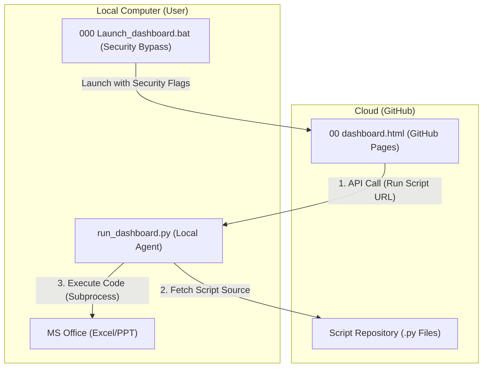

# [구현 계획서] GitHub 클라우드 대시보드 & 로컬 에이전트 하이이브리드 연동

본 계획서는 `00 dashboard.html`을 GitHub Pages에 호스트하고, 해당 UI에서 클릭된 스크립트를 사용자의 로컬 환경에서 실행하는 **'클라우드 컨트롤 - 로컬 실행'** 구조로의 전환을 제안합니다.

---

## 🔍 사전 문제점 체크리스트 (Critical Checklist)

분석 결과, 웹 브라우저의 보안 정책(Sandbox)으로 인해 발생할 수 있는 다음 5가지 핵심 문제를 해결해야 합니다.

| 번호 | 항목 | 상세 내용 | 해결 전략 | 상태 |
| :--- | :--- | :--- | :--- | :--- |
| **1** | **보안 (CORS)** | GitHub(https)에서 로컬(http)로의 API 요청 차단 | 로컬 서버에 `Access-Control-Allow-Origin` 헤더 추가 | 🟢 해결가능 |
| **2** | **혼합 콘텐츠** | HTTPS 페이지에서 HTTP 로컬 서버 호출 시 브라우저 차단 | 런처(`bat`)에서 브라우저 보안 플래그 강제 적용 | 🟢 해결가능 |
| **3** | **코드 실행** | 웹 브라우저는 로컬 파일을 읽거나 실행할 수 없음 | 로컬 에이전트가 GitHub에서 소스를 받아 로컬에서 구동 | 🟢 해결가능 |
| **4** | **오프라인** | 인터넷 차단 시 GitHub 접근 불가 | **Hybrid Cache 시스템**: 온라인 시 GitHub에서 동기화, 오프라인 시 로컬 캐시 스크립트 강제 사용 | 🟢 확정 |
| **5** | **데이터 보안** | 외부 웹 접속에 따른 로컬 오피스 데이터 유출 우려 | 스크립트는 원격에서 받되, 데이터 연산은 **100% 로컬 메모리**에서 수행 | 🟢 보증 |

---

## 🛠️ 제안하는 아키텍처 변화

---

## 📋 핵심 변경 사항

### 1. 로컬 브릿지 에이전트 (`run_dashboard.py`) 수정
웹 브라우저의 요청을 받아 원격의 코드를 로컬로 끌어오는 중계소 역할을 강화합니다.
- **[MODIFY] [run_dashboard.py](file:///d:/03%20%EA%B8%88%EC%9D%BC%EC%9E%91%EC%97%85/00%20%EC%9E%84%EC%8B%9C/00000%20%EC%8A%A4%ED%81%AC%EB%A6%BD%ED%8A%B8/01%20Scripts/run_dashboard.py)**
    - CORS(Cross-Origin Resource Sharing) 허용 로직 추가.
    - GitHub `Raw Content` URL로부터 파이썬 코드를 다운로드하여 로컬 임시 폴더에 캐싱하는 기능 탑재.
    - 다운로드된 코드에 대한 보안 키워드 필터링(악성 코드 방지).

### 2. 하이브리드 대시보드 UI (`00 dashboard.html`) 수정
GitHub에 업로드되어도 로컬 에이전트와 통신할 수 있도록 통신 엔드포인트를 정합합니다.
- **[MODIFY] [00 dashboard.html](file:///d:/03%20%EA%B8%88%EC%9D%BC%EC%9E%91%EC%97%85/00%20%EC%9E%84%EC%8B%9C/00000%20%EC%8A%A4%ED%81%AC%EB%A6%BD%ED%8A%B8/01%20Scripts/00%20dashboard.html)**
    - `localhost:8501/run` 대신 `localhost:8501/remote_run` 인터페이스 연동.
    - 로컬 에이전트 미구동 시 브라우저 알림창을 통한 '에이전트 실행 권장' 알림 기능.

### 3. 보안 보안 우회 런처 (`000 Launch_dashboard.bat`) 수정
사용자가 웹 도메인을 신뢰할 수 있는 지역으로 브라우저에 강제로 인지시키는 파라미터를 추가합니다.
- **[MODIFY] [000 Launch_dashboard.bat](file:///d:/03%20%EA%B8%88%EC%9D%BC%EC%9E%91%EC%97%85/00%20%EC%9E%84%EC%8B%9C/00000%20%EC%8A%A4%ED%81%AC%EB%A6%BD%ED%8A%B8/01%20Scripts/000%20Launch_dashboard.bat)**
    - `--unsafely-treat-insecure-origin-as-secure` 옵션을 통해 특정 GitHub 주소와의 `mixed content` 문제 해결.

---

## ❓ 오픈 질문 (Open Question)

> [!IMPORTANT]
> 1. **스크립트 저장 방식**: **Public(공개)** 저장소로 확정되었습니다. 별도의 토큰 없이 `raw.githubusercontent.com`을 통해 즉시 접근합니다.
> 2. **인터넷 단절 모드**: **완전 폐쇄망** 대응을 위해 **"온라인 시 자동 동기화 + 오프라인 시 로컬 실행"** 하이브리드 모드인 **[Sync-on-Demand]**를 구현합니다.

---

## 🧪 검증 계획

### 자동화 테스트
- `run_dashboard.py`에 CORS 요청을 보내고 정상적인 200 OK 응답이 오는지 확인.
- 임의의 GitHub URL에서 스크립트를 읽어와 에러 없이 로컬 실행되는지 로그 확인.

### 수동 확인
- GitHub Pages에 배포된 대시보드를 열고, 카드 클릭 시 로컬 컴퓨터의 엑셀/파워포인트 압축기가 정상 호출되는지 최종 확인.
