# [구현 계획서] GitHub 클라우드 대시보드 & 로컬 에이전트 하이이브리드 연동

본 계획서는 `00 dashboard.html`을 GitHub Pages에 호스트하고, 해당 UI에서 클릭된 스크립트를 사용자의 로컬 환경에서 실행하는 **'클라우드 컨트롤 - 로컬 실행'** 구조로의 전환을 제안합니다.

---

## 🔍 사전 문제점 체크리스트 (Critical Checklist)

분석 결과, 웹 브라우저의 보안 정책(Sandbox)으로 인해 발생할 수 있는 다음 5가지 핵심 문제를 해결해야 합니다.

| 번호 | 항목 | 상세 내용 | 해결 전략 | 상태 |
| :--- | :--- | :--- | :--- | :--- |
| **1** | **보안 (CORS)** | GitHub(https)에서 로컬(http)로의 API 요청 차단 | 로컬 서버에 `Access-Control-Allow-Origin` 헤더 추가 | 🟢 해결가능 |
| **2** | **실행 자동화** | 브라우저에서 로컬 명령어를 즉시 실행 불가 (Sandbox) | **Smart Launcher (MSIX/Protocol)**: 최초 1회 승인 후 원클릭 실행 체계 구축 | 🆕 연구중 |
| **3** | **코드 실행** | 웹 브라우저는 로컬 파일을 직접 실행할 수 없음 | **Local Agent** 연동 및 사용자 수동 '복합 실행' 유도 | 🟢 해결가능 |
| **4** | **오프라인** | 인터넷 차단 시 GitHub 접근 불가 | **PWA/Service Worker**: 오프라인 대시보드 리소스 로딩 지원 | 🟢 확정 |
| **5** | **환경 설정** | 초보자의 컴퓨터에 Python 등 필수 환경 미비 | **Zero-Config Wizard**: JS 기반 로컬 환경 점검 + PowerShell 자동 설치 스크립트 | 🟢 추가됨 |

## 🛠️ [DEEP ANALYSIS] 대시보드 전수 분석 및 매핑

`00 dashboard.html` 코드 분석 결과, 총 **18개의 카드 섹션**과 **7개의 상세 가이드**가 확인되었습니다. 이를 누락 없이 관리하기 위해 다음과 같이 저장소 경로를 확정합니다.

### 1. UI 그룹별 전수 점검 및 폴더 매핑 리스트

| 대시보드 그룹 명칭 | 대상 파일 (Filename) | 기능 정의 (Title) | 배포 위치 (GitHub) |
| :--- | :--- | :--- | :--- |
| **📝 견적 작성 활용** | `search_two_items.py` | 초고속 텍스트 탐색기 | `automated_scripts/` |
| | `batch_copy_pdf.py` | 파일 스마트 복제 매니저 | `automated_scripts/` |
| | `pattern_document_merger.py` | 패턴 기반 통합 병합기 | `automated_scripts/` |
| | `intelligent_file_organizer.py` | 지능형 파일 정리기 | `automated_scripts/` |
| | `excel_compressor_tool.py` | 엑셀 전용 압축기 | `automated_scripts/` |
| | `ppt_compressor_tool.py` | 파워포인트 전용 압축기 | `automated_scripts/` |
| **📊 엑셀 정밀 정제 및 교정** | `excel_deep_cleaner.py` | 엑셀 딥-클리너 | `automated_scripts/` |
| | `modify_excel_repair.py` | 엑셀 구조 수리공 | `automated_scripts/` |
| | `advanced_excel_rename.py` | 금액 무결성 검증기 | `automated_scripts/` |
| | `advanced_column_modifier.py` | 엑셀 열 교정 도구 | `automated_scripts/` |
| **🗜️ 오피스 최적화 및 변환** | `pdf_to_html_converter_ultimate.py` | PDF → HTML 변환 | `automated_scripts/` |
| | `Batch_PPT_to_PDF_DDD.py` | PPT → PDF 일괄 변환 | `automated_scripts/` |
| | `advanced_pdf_compressor.py` | PDF 정밀 압축기 | `automated_scripts/` |
| | `universal_office_optimizer.py` | 만능 오피스 최적화 | `automated_scripts/` |
| **📁 파일 관리 및 지능형 정리** | `group_cross_merger.py` | 통합 문서 관리자 | `automated_scripts/` |
| | `collect_closing_data.py` | 마감 자료 수집기 | `automated_scripts/` |
| **📘 가이드 및 규정 문서** | `00 PRD 가이드.md` | 자산 정의서 (Constitution) | `system_guides/` |
| | `AI_CODING_GUIDELINES_2026.md` | 개발 표준 가이드라인 | `system_guides/` |
| **📋 시스템 안정성 및 감사 보고서** | `Office_Stability_Audit_Report.md` | 안정성 감사 보고서 | `system_guides/` |
| **⚙️ 기타 운영 자산** | `000 프롬프트(스크립트).txt` | 프롬프트 라이브러리 | `system_guides/` |

### 2. 가이드 섹션 전용 관리 (`system_guides/`)
HTML 내부에 인라인으로 포함된 아래 가이드들은 관리 편의를 위해 `system_guides/` 폴더 내 마크다운 파일로 동기화 관리합니다.
- `📘 스크립트 추가 및 관리 가이드` → 대시보드 HTML 내장
- `🆘 문제 해결: Python 환경 구축` → 대시보드 HTML 내장
- `🛡️ 항시 가동 서버 및 UAC 대응` → 대시보드 HTML 내장

> **참고**: 위 3개 가이드는 이미 `00 dashboard.html` 내에 `<details>` 태그로 인라인 포함되어 있으므로,
> 별도 파일로 분리하지 않고 HTML 내에서 관리합니다. 내용 변경 시 HTML 코드를 직접 수정하세요.

---

## 🛠️ 제안하는 아키텍처 변화

```mermaid
graph TD
    subgraph "Cloud (GitHub Pages)"
        UI["00 dashboard.html (JS/CSS Wizard)"]
        Repo["Script Repo (.py / .whl)"]
    end

    subgraph "Local Computer (Target System)"
        Check["Local Status Check (fetch 'localhost')"]
        Boot["PS1 Bootstrap (One-liner Setup)"]
        Agent["run_dashboard.py (Active Service)"]
        Office["MS Office (Excel/PPT)"]
    end

    UI -- "1. Connection Check (JS)" --> Check
    Check -- "2. If Not Ready: Show Setup Wizard" --> UI
    UI -- "3. Copy PS1 Command" --> Boot
    Boot -- "4. Auto-Install Environment" --> Agent
    Agent -- "5. Execution Request" --> Office
```



---

## 🧪 [RESEARCH] '원클릭 실행' 자동화 연구 보고

브라우저의 보안 정책상 **"JS에서 즉시 로컬 터미널을 열고 명령어를 입력시키는 것"**은 불가능합니다. 하지만 초보자를 위해 그 과정을 90% 이상 자동화하는 **'스마트 런처'** 전략을 제안합니다.

### 1. 웹 마법사 기반 'Smart Bootloader' (대안 1)
- **방식**: 대시보드 로딩 시 환경이 없는 초보자에게 **'시스템 점검 및 자동 실행기'**를 내려받도록 유도.
- **자동화 포인트**:
    - 사용자가 다운로드된 파일을 '한 번만 클릭'하면, 해당 파일 내부에 포함된 스크립트가 PowerShell을 자동으로 띄우고 모든 환경(Python, 패키지 등)을 구축합니다.
    - 웹 페이지(JS)는 파일이 다운로드된 시점부터 로컬 포트(`8501`)를 0.5초 간격으로 스캔하여, 사용자가 파일을 실행하는 즉시 UI를 '준비 완료' 상태로 전환합니다.

### 2. Custom Protocol Handler 등록 (대안 2 - 고급화)
- **방식**: `vscode://` 처럼 대시보드 전용 프로토콜(`antigravity://run`)을 로컬 시스템에 등록.
- **자동화 포인트**:
    - 최초 환경 설정 시 이 프로토콜을 한 번만 등록해두면, 이후부터는 대시보드에서 버튼 클릭 시 브라우저가 **"이 앱을 실행할까요?"**라는 팝업만 띄우고 승인 시 즉시 로컬 스크립트가 구동됩니다.
    - 왕초보에게는 프로토콜 등록 과정마저 '자동 설정 파일' 하나로 해결하도록 설계합니다.

### 3. Windows App Installer (MSIX) 활용 (대안 3 - 최적화)
- **방식**: 대시보드와 로컬 에이전트를 하나의 **Windows 앱 패키지(.msix)**로 말아서 배포.
- **자동화 포인트**:
    - 사용자가 웹사이트에서 '설치' 버튼을 누르면 Windows 표준 설치 GUI가 뜨며, 완료 후에는 브라우저와 완벽하게 연동됩니다.
    - **장점**: 보안 경고를 최소화하고 일반적인 앱 설치 경험을 제공하여 거부감을 줄임.

---

## 📋 핵심 업데이트 사항 (Summary)

1.  **배포 패키지**: `.py`나 `.bat` 개별 파일이 아닌, 모든 환경이 포함된 **'원클릭 통합 런처'**를 대시보드 UI에서 직접 다운로드 가능하게 구현.
2.  **실시간 상태 동기화**: JS가 백그라운드에서 로컬 상태를 계속 추적하여, 사용자가 무언가를 설치/실행하는 즉시 대시보드의 '빨간 불'이 '초록 불'로 바뀌며 로딩 애니메이션이 사라지는 **'Zero-Touch Feedback'** 구현.
3.  **UI/UX**: "PowerShell에 복사하세요"라는 문구를 삭제하고, **"이 설치 파일을 열어주세요"**라는 시각적 가이드(화살표 및 애니메이션)로 대체.---

## ❓ 오픈 질문 (Open Question)

> [!IMPORTANT]
> 1. **스크립트 저장 방식**: **Public(공개)** 저장소로 확정되었습니다. 별도의 토큰 없이 `raw.githubusercontent.com`을 통해 즉시 접근합니다.
> 2. **인터넷 단절 모드**: **완전 폐쇄망** 대응을 위해 **"온라인 시 자동 동기화 + 오프라인 시 로컬 실행"** 하이브리드 모드인 **[Sync-on-Demand]**를 구현합니다.

---

## 📂 배포 및 폴더 구조 최적화 (Project Structure)

GitHub 배포 시의 무결성을 유지하기 위해 로컬 작업 환경을 GitHub 저장소 구조와 1:1로 매칭합니다.

### 1. 로컬 작업 디렉토리 구성 (최종 확정)
- **경로**: `../00000 스크립트/깃허브`
- **구조** (= GitHub 저장소 루트와 100% 동일):
  ```text
  00000 스크립트/
  ├── 01 Scripts/          (원본/백업/레거시 보관 - 절대 수정 금지)
  └── 깃허브/              (최종 배포용 = GitHub 저장소 루트)
      ├── 00 dashboard.html         (All-in-One Dashboard)
      ├── run_dashboard.py          (Local Agent - 브릿지 서버)
      ├── 000 Launch_dashboard.bat  (Launcher - 자동 환경 구축)
      ├── automated_scripts/        (16종 .py 파일 전수)
      │   ├── group_cross_merger.py
      │   ├── pdf_to_html_converter_ultimate.py
      │   ├── Batch_PPT_to_PDF_DDD.py
      │   ├── advanced_pdf_compressor.py
      │   ├── universal_office_optimizer.py
      │   ├── excel_deep_cleaner.py
      │   ├── modify_excel_repair.py
      │   ├── advanced_excel_rename.py
      │   ├── advanced_column_modifier.py
      │   ├── search_two_items.py
      │   ├── batch_copy_pdf.py
      │   ├── pattern_document_merger.py
      │   ├── intelligent_file_organizer.py
      │   ├── excel_compressor_tool.py
      │   ├── ppt_compressor_tool.py
      │   └── collect_closing_data.py
      └── system_guides/             (4종 문서 전수)
          ├── 00 PRD 가이드.md
          ├── AI_CODING_GUIDELINES_2026.md
          ├── Office_Stability_Audit_Report.md
          └── 000 프롬프트(스크립트).txt
  ```

> **⚠️ 무결성 원칙**: `01 Scripts/` 폴더의 원본 파일은 절대 수정하지 않습니다.
> `깃허브/` 폴더는 원본의 **복사본**으로 구성되며, 개선 작업은 이 폴더에서만 수행합니다.
> 개선 완료 후 `깃허브/` 폴더 전체를 GitHub 저장소에 업로드합니다.

### 2. 웹(GitHub) 배포의 필요성 (Rationale)
"단독 실행형 HTML"로 리소스를 병합하더라도 `.py` 스크립트와 가이드 파일을 깃허브에 배포해야 하는 이유는 다음과 같습니다.
- **실시간 코드 동기화**: 로컬 에이전트(`run_dashboard.py`)는 항상 GitHub의 `automated_scripts/` 폴더에서 최신 소스를 가져와 실행합니다. 즉, 사용자가 수동으로 파일을 업데이트할 필요 없이 깃허브에 코드를 올리는 것만으로 전 사용자에게 최신 기능이 배포됩니다.
- **Zero-Setup 다운로드**: 초보 사용자가 대시보드만 열었을 때, `system_guides/` 내의 설명서나 필수 실행 파일들(`.bat`, `.py`)을 깃허브 Raw 링크를 통해 즉시 내려받을 수 있도록 하기 위함입니다.
- **버전 관리**: 개선 및 수정 이력을 깃허브에서 관리하여, 문제 발생 시 즉각적인 롤백이 가능합니다.

---

## 🧪 검증 계획

### 자동화 테스트
- `run_dashboard.py`에 CORS 요청을 보내고 정상적인 200 OK 응답이 오는지 확인.
- 임의의 GitHub URL에서 스크립트를 읽어와 에러 없이 로컬 실행되는지 로그 확인.

### 수동 확인
- GitHub Pages에 배포된 대시보드를 열고, 카드 클릭 시 로컬 컴퓨터의 엑셀/파워포인트 압축기가 정상 호출되는지 최종 확인.
