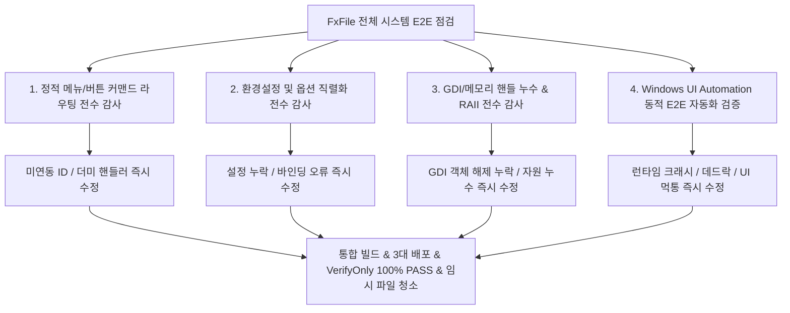

# FxFile 전체 시스템(메뉴·옵션·버튼·누수·오류) E2E 전수 점검 및 즉시 결함 해결 계획

FxFile의 모든 메뉴, 옵션, 설정, 버튼 및 백엔드 로직에 대해 작동 불능, 핸들러 누락, GDI/메모리 누수, 크래시를 전수 점검하고 즉시 해결하는 E2E 무결성 보증 계획입니다.

---

## 1. 전수 점검 및 테스트 범위

---

## 2. 단계별 세부 계획

### Step 1: 정적 메뉴 및 버튼 커맨드 라우팅 전수 감사 (Static Command Audit)
- `resource.h`에 선언된 300+ 개의 모든 `ID_*` 커맨드(메뉴 항목, 툴바 버튼, 단축키, 컨텍스트 메뉴 등)를 추출.
- `main_frame.cpp`, `explorer_view.cpp`, `explorer_ctrl.cpp`, `picture_viewer.cpp`, `search_dlg.cpp` 등의 `BEGIN_MESSAGE_MAP` 매핑 상태를 자동 스크립트로 전수 대조.
- 핸들러가 없거나 `// TODO` 또는 빈 블록으로 방치된 미구현/오작동 메뉴 및 버튼을 전수 식별하여 즉시 구현.

### Step 2: 옵션 및 설정 직렬화 전수 감사 (Option & Settings Audit)
- `option.h`의 모든 옵션 구조체(`OptionConfig`, `OptionMain`, `OptionExplorer`, `OptionFileOp`, `OptionFontColor`, `OptionView` 등)와 `option_manager.cpp`의 INI/XML/레지스트리/DAT 파일 직렬화 로직 대조.
- 환경설정 다이얼로그(`OptionDialog` 및 각 탭 페이지 `OptionPage*`)의 UI 컨트롤과 설정 변수 간 양방향 입출력(`DoDataExchange`, `setOption`, `getOption`) 누락 여부 전수 점검 및 즉시 수정.

### Step 3: GDI 오브젝트 및 메모리 누수 정적 감사 (Resource Leak Audit)
- GDI 핸들(`HDC`, `HBITMAP`, `HFONT`, `HPEN`, `HBRUSH`, `SelectObject`) 생성 후 `DeleteObject` / `ReleaseDC` 누락 여부 정적 코드 분석.
- `new` 할당 후 예외 또는 조기 반환(`early return`) 경로에서 메모리 누수 가능성이 있는 코드 블록을 탐색하여 RAII 스마트 포인터(`std::unique_ptr` 등) 또는 명시적 해제로 즉각 보강.

### Step 4: Windows UI Automation 동적 E2E 자동화 테스트 스크립트 구축 및 실행
- PowerShell의 .NET `System.Windows.Automation` 라이브러리를 활용한 전수 E2E 자동화 스크립트(`tools/test_e2e_full_system.ps1`) 제작:
  1. **메뉴 바 전수 순회**: `파일`, `편집`, `이동`, `보기`, `도구`, `창`, `도움말` 및 하위 서브메뉴 전체를 자동 순회 호출하여 크래시 여부 점검.
  2. **메인 툴바 & 쿨바 버튼 상호작용**: 위로, 앞으로, 뒤로, 비우기, 검색, 계산기, 드라이브 바, 북마크 바 버튼 클릭 및 반응성 점검.
  3. **환경설정 창 호출 및 각 탭 순회**: 설정 창 기동 -> 일반, 보기, 파일 작업, 색상/글꼴, 북마크 탭 전환 -> 적용/확인/취소 사이클 점검.
  4. **도킹 뷰어 및 4개 탐색창 분할 점검**: 이미지 도킹, 줌 인/아웃, PAN 드래그 동작 후 리소스 핸들 누수 점검.
  5. **프로세스 정상 종료 후 GDI/User 핸들 카운트 감사**: 핸들이 누적되거나 고착되는 현상이 없는지 프로세스 메트릭 측정.

### Step 5: 최종 빌드, 배포, 무결성 감사, 임시 파일 정리 및 최종 리포트
- 발견된 모든 결함 수정 후 `build_deploy_all.bat`으로 Release x64/x32 통합 컴파일 및 3대 대상 배포.
- `__BUILD_TEMP_BACKUP__` 및 C: 드라이브 Temp 캐시 전수 정리.
- `Build-Deploy-Verify.ps1 -Mode VerifyOnly` 100% 무결성 PASS 확인.
- 최종 E2E 진행 결과 및 조치 내역 일괄 보고서 작성.

---

## 3. 검증 계획

### 자동화 검증
- `powershell.exe -ExecutionPolicy Bypass -File tools/test_e2e_full_system.ps1`: 전체 E2E 자동화 테스트 100% 통과.
- `powershell.exe -ExecutionPolicy Bypass -File tools/Build-Deploy-Verify.ps1 -Mode VerifyOnly`: 100% PASS 및 10대 정본 설정 일치.
- 프로세스 검사: 잔여 프로세스 0개 확인.
- 디스크 정리: `__BUILD_TEMP_BACKUP__` 최신 1개 유지 및 Temp 폴더 청정 상태 확인.
