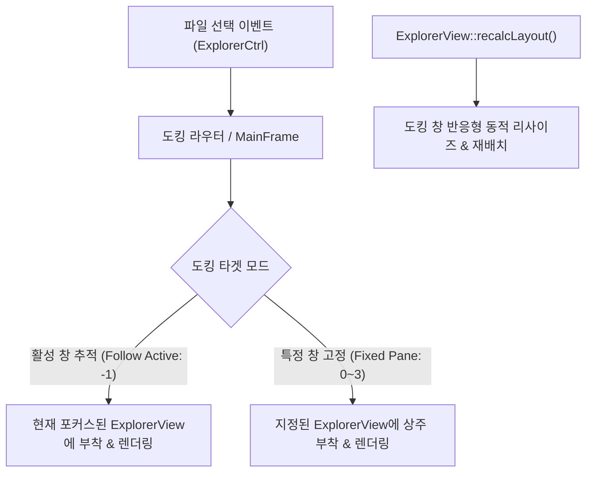

# Task 064: 2x2 및 다중·단일 창 자유 지정 이미지 도킹 시스템 구축 및 무결성 보증 리팩토링 상세 계획서

## 1. 개요 및 배경

현재 FxFile의 이미지 뷰어(`PictureViewer`)는 과거 단일 창 전용으로 작성되어 다음과 같은 치명적인 레거시 제약이 존재합니다:
1. **분할 창(2x2, 1x2, 2x1) 도킹 원천 차단**: `sViewSplitRowCount > 1` 분할 환경에서 "단일 분할 창에서만 지원합니다" 메시지를 띄우며 도킹을 거부함.
2. **단일 뷰 고정 바인딩**: 무조건 기본 0번 `ExplorerView`에만 부모를 설정하여 다중 창에서 다른 창과 연동 불가.
3. **하드코딩된 위치(`MoveWindow(5, 250, 190, 170)`)**: 부모 크기나 DPI 스케일링, 스플리터 이동과 연동되지 않아 레이아웃이 어긋남.
4. **사용자 지정 도킹 인터페이스 부재**: 사용자가 원하는 특정 창을 선택하여 도킹할 수 없음.

본 계획은 최신 데스크톱 파일 관리자 아키텍처 패턴을 적용하여, **2x2, 1x2, 2x1, 1x1 모든 레이아웃에서 사용자가 원하는 창(활성 창 자동 추적 또는 창 1~4 특정 창 고정)을 자유롭게 지정하여 반응형으로 도킹할 수 있는 현대적 이미지 도킹 시스템**을 구축합니다.

---

## 2. 세부 설계 및 아키텍처

### 2.1 도킹 타겟 모드 (Target Panel Docking)
* **`DOCK_TARGET_ACTIVE` (-1)**: 사용자가 탐색기 창(1번, 2번, 3번, 4번 패널) 중 어느 곳을 클릭하든 이미지 도킹 창이 활성 패널로 동적으로 부모를 전환하여 실시간 미리보기를 제공.
* **`DOCK_TARGET_PANE_1` (0) ~ `DOCK_TARGET_PANE_4` (3)**: 4개 분할 창 중 사용자가 원하는 특정 창(예: 4번 우하단 창)을 전용 미리보기 패널로 고정하여, 다른 창에서 파일을 선택해도 지정된 창의 이미지 뷰어에 이미지가 즉시 표시됨.

### 2.2 반응형 레이아웃 및 하드코딩 제거
* `ExplorerView::recalcLayout()`에 도킹된 `PictureViewer`의 가용 사각형(`CRect`) 계산 및 배치 로직을 통합.
* 하드코딩 좌표(`5, 250`) 완전 제거 -> 부모 창 크기, DPI 스케일링, 폴더 트리 너비에 맞춰 안전하고 자연스러운 반응형 레이아웃 유지.

### 2.3 UI 메뉴 및 상태 영속화
* `IDR_PIC_VIEWER` 컨텍스트 메뉴에 `도킹 대상` 서브메뉴 추가:
  * `[✔] 현재 활성 창 (Follow Active Pane)`
  * `창 1 (좌상/단일)`
  * `창 2 (우상/우측)`
  * `창 3 (좌하)`
  * `창 4 (우하)`
* `fxfile-main.conf` / `DlgState`에 도킹 상태(`Docking`) 및 타겟 창(`DockTarget`)을 영속 저장하여 재실행 시 100% 복원.

---

## 3. 작업 및 검증 순서

1. **안전 게이트 통과**: `preflight_build_environment.bat` 실행 및 PASS 확인.
2. **소스 코드 리팩토링**:
   - `src/fxfile/picture_viewer.h` & `picture_viewer.cpp`
   - `src/fxfile/explorer_view.h` & `explorer_view.cpp`
   - `src/fxfile/main_frame.h` & `main_frame.cpp`
   - `src/fxfile/resource.h` & `fxfile.rc` & `Korean.xml`
3. **통합 빌드 및 배포**: `build_deploy_all.bat`로 x64/x32 릴리스 컴파일 및 3개 패키지 배포.
4. **동적 샌드박스 실측**: 2x2 분할 창 도킹, 활성 창 전환, 특정 창 고정 렌더링 검증.
5. **사후 정리 (`0.7.3` 준수)**: 임시 파일 정리 및 `VerifyOnly` 100% 무결성 감사.
