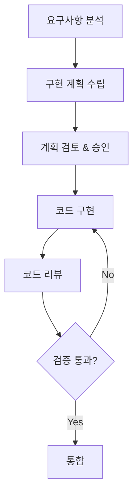

# 🚀 2026 AI 코딩 품질 최적화 가이드라인

> **버전**: v35.4.18 Hardening | **최종 업데이트**: 2026-03-12  
> **적용 대상**: React/JavaScript/TypeScript 기반 단일 파일 웹 애플리케이션 및 Python Office 자동화  
> **참조 표준**: NIST AI RMF, ISO/IEC 42001, EU AI Act, Anthropic CLAUDE.md

---

## 📋 목차

1. [아키텍처 원칙](#1-아키텍처-원칙)
2. [클린 코드 원칙](#2-클린-코드-원칙)
3. [AI 협업 가이드라인](#3-ai-협업-가이드라인)
4. [React/JavaScript 스타일 가이드](#4-reactjavascript-스타일-가이드)
5. [보안 및 규정 준수](#5-보안-및-규정-준수)
6. [테스트 및 품질 보증](#6-테스트-및-품질-보증)
7. [문서화 표준](#7-문서화-표준)
8. [성능 최적화](#8-성능-최적화)
9. [Python Office 자동화 가이드](#9-python-office-automation-가이드-powerpoint-excel)
10. [초격차 안정성 심층 기술 분석](#10-초격차-안정성-심층-기술-분석)

---

## 1. 아키텍처 원칙

### 1.1 클린 레이어 아키텍처 (Clean Layer Architecture)

단일 파일 애플리케이션에서도 **4계층 분리**를 준수합니다:

```
┌─────────────────────────────────────────────────────────────┐
│ LAYER 4: FRAMEWORKS & UI (프레젠테이션)                      │
│ - React 컴포넌트, Custom Hooks, Context                     │
│ - 사용자 인터랙션 처리                                        │
├─────────────────────────────────────────────────────────────┤
│ LAYER 3: INTERFACE ADAPTERS (인터페이스 어댑터)              │
│ - Repository 패턴 (StorageRepository)                       │
│ - 외부 시스템 어댑터 (ExcelAdapter, HTMLExportAdapter)       │
├─────────────────────────────────────────────────────────────┤
│ LAYER 2: USE CASES (유스케이스)                              │
│ - 비즈니스 로직 함수                                         │
│ - 통계 계산, CRUD 오퍼레이션                                 │
├─────────────────────────────────────────────────────────────┤
│ LAYER 1: DOMAIN (도메인)                                     │
│ - 엔티티, 값 객체, 상수                                      │
│ - 팩토리 함수                                                │
└─────────────────────────────────────────────────────────────┘
```

### 1.2 의존성 규칙 (Dependency Rule)

```javascript
// ✅ 올바름: 상위 레이어가 하위 레이어에 의존
const App = () => {
    const data = StorageRepository.load();           // Layer 4 → Layer 3
    const stats = calculateStatistics(data);         // Layer 3 → Layer 2
    const formatted = Formatters.currency(stats.total); // Pure function
};

// ❌ 잘못됨: 하위 레이어가 상위 레이어에 의존
const calculateStatistics = () => {
    ReactDOM.render(...);  // Domain/UseCase가 UI에 의존하면 안됨
};
```

### 1.3 단일 책임 원칙 (SRP)

각 모듈/함수는 **하나의 책임**만 가집니다:

| 책임 | 담당 모듈 | 예시 |
|------|----------|------|
| 데이터 스키마 | Domain Constants | `DOMAIN_CONSTANTS`, `createNewItem()` |
| 비즈니스 로직 | Use Cases | `calculateStatistics()`, `ItemUseCases` |
| 외부 I/O | Adapters | `StorageRepository`, `ExcelAdapter` |
| UI 렌더링 | Components | `StatCard`, `PlanTable`, `AppHeader` |

---

## 2. 클린 코드 원칙

### 2.1 SOLID 원칙

| 원칙 | 설명 | 적용 예시 |
|------|------|----------|
| **S**ingle Responsibility | 한 클래스/함수는 하나의 이유로만 변경 | `calculateStatistics()`는 통계만 계산 |
| **O**pen/Closed | 확장에 열려있고, 수정에 닫혀있음 | 새 Adapter 추가로 기능 확장 |
| **L**iskov Substitution | 부모 타입 자리에 자식 타입 대체 가능 | Repository 인터페이스 |
| **I**nterface Segregation | 클라이언트에 필요한 인터페이스만 노출 | 필요한 handler만 props로 전달 |
| **D**ependency Inversion | 고수준 모듈이 저수준 모듈에 의존하지 않음 | UseCase가 Repository 인터페이스에 의존 |

### 2.2 DRY/KISS/YAGNI

```javascript
// ✅ DRY: 반복 로직 추출
const sumCost = (arr) => arr.reduce((acc, item) => acc + (Number(item.cost) || 0), 0);
const confirmedOnly = (arr) => arr.filter(i => i.confirmed);

// 재사용
const totalCost = sumCost(items);
const confirmedCost = sumCost(confirmedOnly(items));

// ✅ KISS: 단순하게 유지
const isInvestment = (item) => 
    item.category?.replace(/\s/g, '').includes('투자');

// ✅ YAGNI: 필요할 때만 구현
// 미래에 필요할 "것 같은" 기능은 구현하지 않음
```

### 2.3 네이밍 컨벤션

| 대상 | 규칙 | 예시 |
|------|------|------|
| React 컴포넌트 | PascalCase | `StatCard`, `PlanTable` |
| 함수/변수 | camelCase | `calculateStatistics`, `handleChange` |
| 상수 | SCREAMING_SNAKE_CASE | `DOMAIN_CONSTANTS`, `STORAGE_KEY` |
| 커스텀 훅 | use 접두사 | `usePlanData`, `useFileHandlers` |
| 불리언 변수 | is/has/can 접두사 | `isConfirmed`, `hasError` |
| 이벤트 핸들러 | handle/on 접두사 | `handleClick`, `onSubmit` |

### 2.4 함수 설계 원칙

```javascript
// ✅ 좋은 함수: 작고, 한 가지 일만, 명확한 이름
const toggleConfirm = (items, id) =>
    items.map(item => item.id === id 
        ? { ...item, confirmed: !item.confirmed } 
        : item
    );

// ❌ 나쁜 함수: 여러 일을 하고, 길고, 부작용 있음
const doEverything = (items, id) => {
    // 확정 토글
    // 통계 계산
    // 로컬스토리지 저장
    // 알림 표시
    // ... 200줄 이상
};
```

---

## 3. AI 협업 가이드라인

### 3.1 프롬프트 엔지니어링 원칙

```markdown
## 효과적인 AI 프롬프트 작성법

1. **명확한 컨텍스트 제공**
   - 현재 기술 스택 명시
   - 기존 코드 구조 설명
   - 원하는 동작 상세 기술

2. **작업 분할**
   - 큰 작업을 작은 단위로 분할
   - 단계별 접근 요청
   - 중간 결과 확인 후 진행

3. **제약 조건 명시**
   - 사용할 라이브러리 제한
   - 코딩 스타일 요구사항
   - 성능 목표
```

### 3.2 AI 생성 코드 검증 체크리스트

```markdown
□ 논리적 정확성 검증 (Hallucination 체크)
□ 아키텍처 정합성 확인
□ 보안 취약점 검토
□ 성능 영향 분석
□ 기존 코드와의 일관성
□ 테스트 커버리지 확인
□ 에지 케이스 처리
```

### 3.3 Plan-Then-Execute 워크플로우



---

## 4. React/JavaScript 스타일 가이드

### 4.1 컴포넌트 구조

```javascript
// ✅ 권장 컴포넌트 구조 (최대 150-200줄)
const ComponentName = ({ prop1, prop2 }) => {
    // 1. Hooks (useState, useEffect, useMemo...)
    const [state, setState] = useState(initialValue);
    
    // 2. Derived values / Computed
    const computedValue = useMemo(() => {
        return expensiveCalculation(state);
    }, [state]);
    
    // 3. Event handlers
    const handleClick = useCallback(() => {
        // 처리 로직
    }, [dependencies]);
    
    // 4. Effects
    useEffect(() => {
        // 부수 효과
        return () => { /* 정리 */ };
    }, [dependencies]);
    
    // 5. Render
    return (
        <div>
            {/* JSX */}
        </div>
    );
};
```

### 4.2 훅 사용 가이드

```javascript
// ✅ useState: 단순 상태
const [count, setCount] = useState(0);

// ✅ useReducer: 복잡한 상태 로직
const [state, dispatch] = useReducer(reducer, initialState);

// ✅ useMemo: 비용이 큰 계산 캐싱
const expensiveValue = useMemo(() => computeExpensive(a, b), [a, b]);

// ✅ useCallback: 함수 참조 안정화
const handleClick = useCallback(() => doSomething(id), [id]);

// ❌ 과도한 메모이제이션 지양
const simpleValue = useMemo(() => a + b, [a, b]); // 불필요
```

### 4.3 JSX 가독성

```jsx
// ✅ 조건부 렌더링: 명확한 패턴 사용
{isLoading && <Spinner />}
{error ? <Error message={error} /> : <Content data={data} />}

// ✅ 리스트 렌더링: key 필수
{items.map(item => (
    <Item key={item.id} {...item} />
))}

// ✅ 긴 props: 멀티라인 포맷
<Button
    variant="primary"
    size="large"
    onClick={handleClick}
    disabled={isDisabled}
>
    클릭
</Button>
```

---

## 5. 보안 및 규정 준수

### 5.1 보안 체크리스트

```markdown
## 필수 보안 검토 항목

### 입력 검증
□ 모든 사용자 입력 검증
□ XSS 공격 방지 (innerHTML 사용 금지)
□ SQL/NoSQL 인젝션 방지

### 데이터 보호
□ 민감 정보 암호화
□ 하드코딩된 비밀정보 없음
□ HTTPS 강제 사용

### 의존성 보안
□ 최신 보안 패치 적용
□ 알려진 취약점 없음
□ 라이선스 호환성 확인
```

### 5.2 규정 준수 (2026 기준)

| 규정 | 요구사항 | 적용 방법 |
|------|---------|----------|
| **EU AI Act** | 투명성, 고위험 AI 규칙 | AI 생성 코드 명시 |
| **NIST AI RMF** | 리스크 관리 프레임워크 | 코드 리뷰 프로세스 |
| **ISO/IEC 42001** | AI 관리 시스템 | 문서화, 추적성 |
| **GDPR** | 개인정보 보호 | 데이터 암호화, 동의 |

---

## 6. 테스트 및 품질 보증

### 6.1 테스트 피라미드

```
        ╱╲
       ╱  ╲        E2E 테스트 (10%)
      ╱────╲       - 사용자 플로우
     ╱      ╲      
    ╱────────╲     통합 테스트 (20%)
   ╱          ╲    - 컴포넌트 상호작용
  ╱────────────╲   
 ╱              ╲  단위 테스트 (70%)
╱────────────────╲ - 개별 함수/컴포넌트
```

### 6.2 AI 생성 코드 테스트 강화

```javascript
// AI 생성 코드에는 추가 테스트 필수
describe('AI Generated: calculateStatistics', () => {
    // 1. 기본 동작
    it('should calculate total cost correctly', () => {});
    
    // 2. 경계 조건
    it('should handle empty array', () => {});
    it('should handle negative costs', () => {});
    
    // 3. 실제 데이터 시뮬레이션
    it('should work with production-like data', () => {});
    
    // 4. 성능 테스트
    it('should complete within 100ms for 1000 items', () => {});
});
```

---

## 7. 문서화 표준

### 7.1 코드 주석 원칙

```javascript
// ✅ 좋은 주석: WHY를 설명
// 임베디드 데이터를 사용하는 이유: n차 HTML 저장 시 
// 정규식 기반 INITIAL_DATA 교체가 실패하기 때문
const getEmbeddedData = () => { ... };

// ❌ 나쁜 주석: WHAT을 반복
// 데이터를 가져오는 함수
const getData = () => { ... };
```

### 7.2 JSDoc 표준

```javascript
/**
 * 계획 아이템의 통계를 계산합니다.
 * 
 * @param {PlanItem[]} items - 계산할 아이템 배열
 * @returns {Statistics} 계산된 통계 객체
 * 
 * @example
 * const stats = calculateStatistics(items);
 * console.log(stats.totalCost); // 171000
 */
const calculateStatistics = (items) => { ... };
```

### 7.3 레이어 구분 주석

```javascript
// ═══════════════════════════════════════════════════════════
// LAYER 1: DOMAIN (Entities & Value Objects)
// - 순수 비즈니스 로직, 외부 의존성 없음
// ═══════════════════════════════════════════════════════════

// ═══════════════════════════════════════════════════════════
// LAYER 2: USE CASES (Application Business Rules)
// - 비즈니스 유스케이스 함수들
// ═══════════════════════════════════════════════════════════
```

---

## 8. 성능 최적화

### 8.1 React 최적화

```javascript
// ✅ 컴포넌트 메모이제이션
const MemoizedComponent = React.memo(({ data }) => (
    <div>{data.name}</div>
));

// ✅ 리스트 가상화 (대량 데이터)
import { FixedSizeList } from 'react-window';

// ✅ 코드 스플리팅
const LazyComponent = React.lazy(() => import('./Component'));

// ✅ 상태 업데이트 배칭
const handleMultipleUpdates = () => {
    // React 18+에서 자동 배칭됨
    setA(1);
    setB(2);
    setC(3);
};
```

### 8.2 번들 크기 최적화

```javascript
// ✅ Tree-shaking 가능한 임포트
import { useState, useEffect } from 'react';

// ❌ 전체 모듈 임포트
import * as React from 'react';

// ✅ 동적 임포트
const loadExcelModule = async () => {
    const XLSX = await import('xlsx');
    return XLSX;
};
```

---

## 9. Python Office Automation 가이드 (PowerPoint/Excel)

### 9.1 인코딩 안전성 (Encoding Safety)

K-컴퓨팅 환경(Windows/CP949)에서의 크래시 방지를 위해 다음 원칙을 준수합니다.

```python
# ✅ 권장: 이모지 대신 텍스트 기반 로그 사용 ([OK], [FAIL], [WARN])
self.logger.log("info", "[OK] 작업 시작")
self.logger.log("error", "[FAIL] 변환 실패")

# ❌ 절대 금지: 이모지가 포함된 모든 출력 (CP949 환경에서 폰트 깨짐 및 프리징 원인)
# 🚀, ✅, ⚠️, 🔄 등 모든 이모지는 텍스트 마커로 대체해야 함
print("작업 시작") # [OK] 또는 [START] 마커 사용 권장
```

**UTF-8 강제 통제 로직:**
```python
import sys
# sys.stdout 인코딩 강제 재설정 (v34.1.16 표준)
try:
    if hasattr(sys.stdout, 'reconfigure'):
        sys.stdout.reconfigure(encoding='utf-8')
    else:
        import io
        sys.stdout = io.TextIOWrapper(sys.stdout.buffer, encoding='utf-8')
except:
    pass
```

### 9.2 COM 객체 안정성 (COM Stability)

Office 프로그램 기동 시 **차단 팝업 및 대화상자**를 완전히 억제해야 합니다.

| 속성 | 권장 값 | 설명 |
|------|-------|------|
| `DisplayAlerts` | `1` (또는 `False`) | 경고창/팝업 억제 |
| `Visible` | `0` (또는 `False`) | 백그라운드 기동 |
| `Interactive` | `False` | 사용자 입력 차단 |
| `AutomationSecurity` | `3` (Low) | 매크로 보안 수준 강제 조정 |

**실패 및 해결 사례: SaveAs 메서드 인자 바인딩 충돌 (UI 팝업 발생)**
- **실패 사례**: Python `win32com`을 통해 Excel의 `.xls` 포맷을 `xlsx(FileFormat=51)`로 저장하려 할 때, `.SaveAs(FileName=path, FileFormat=51)` 형식의 키워드 인자(Kwargs)를 사용하면 윈도우 UI가 개입하여 '다른 이름으로 저장' 대화상자가 무한 대기(Hang)를 유발함.
- **해결 패턴 (강제 수칙)**: `win32com`의 메서드 호출 시 가능한 모든 명명된 인자(Kwargs) 사용을 회피하고 **위치 기반 인자(Positional Argument)**만을 사용하십시오.
  ```python
  # ❌ 금지 (팝업 유발 위험):
  wb.SaveAs(FileName=out_path, FileFormat=51)
  # ✅ 표준 (UI 개입 완전 차단):
  app.AutomationSecurity = 3
  app.Interactive = False 
  wb.SaveAs(out_path, 51)
  ```


### 9.3 프로세스 생명주기 관리

좀비 프로세스(Zombie Process) 방지를 위해 작업 전/후 프로세스 소거 로직을 포함합니다.

```python
def _kill_zombie_processes(self, targets=["powerpnt.exe", "excel.exe"]):
    import psutil
    for p in psutil.process_iter():
        try:
            if p.name().lower() in targets:
                p.terminate()
        except: pass
```

### 9.4 초격차 경로 안전성 및 원자적 교체 (Path Safety & Atomic Replace)

Windows의 물리적 한계인 `MAX_PATH`(260자) 및 파일 교체 시의 데이터 무결성을 보장하기 위해 다음 패턴을 준수합니다. (v35.4.2 표준)

**1. 경로 안전성 하드닝 (Path Safety):**
```python
# ✅ 권장: \\?\ 접두사 사용 및 지능형 단축 (Truncation)
def _safe(path):
    path = os.path.abspath(os.path.normpath(path))
    # 240자 초과 또는 UNC 경로인 경우 특수 접두사 부여
    if len(path) > 240 or path.startswith('\\\\'):
        if not path.startswith('\\\\?\\'):
            if path.startswith('\\\\'):
                return '\\\\?\\UNC\\' + path[2:]
            return '\\\\?\\' + path
    return path

# [v35.4.9] COM Safe Path Protocol: 
# Office COM(Excel/PPT)은 짧은 경로에서 \\?\ 접두사가 있으면 파일을 열지 못하는 호환성 결함이 있음.
# 호출 직전에 260자 미만인 경우 접두사를 명시적으로 제거해야 함.
def get_com_path(safe_path):
    if len(safe_path) < 260 and safe_path.startswith('\\\\?\\'):
        return safe_path[4:]
    return safe_path

# [v35.4.11] Excel COM Name Conflict Defense & Logical Progress:
# Office 앱은 파일명이 메모리에 있으면 추가 오픈을 거부하므로 고유 명칭(Merging_고유ID_...)을 사용해야 함.
# 또한 병합 진행률은 '폴더 x 제품군' 단위의 Task 기반으로 산출하여 논리적 무결성 확보.
def get_unique_merge_path(dir_path, base_name):
    import time
    unique_id = int(time.time() * 1000) % 1000000
    return os.path.join(dir_path, f"Merging_{unique_id}_{base_name}")

# [v35.4.12] Terminology Alignment & Default Filter Policy:
# - 진행 상황 표시 용어를 '진행:'에서 '진행현황:'으로 통일하여 최적화/병합 모드 간 UI 일관성 확보.
# - 시스템 임시 파일 및 백업 파일(.bak, .tmp, .temp)을 기본 제외 필터(exclude_ext_var)로 설정하여 
#   작업 대상 리스트의 정결함과 불필요한 처리 오버헤드 방지.

# [v35.4.13] Proactive Process Management & Temp Integrity:
# - WinError 32(파일 점유) 방지를 위해 작업 전 모든 오피스 프로세스를 강제 청소하고 1초 대기.
# - 재생형 저장 등 임시 파일 생성 로직은 반드시 try-finally 블록을 사용하여 즉각적인 정리를 보장함.

# [v35.4.14] Ultimate Lock Breaking & Deterministic Release:
# - 원본 파일 재기록 전 1.0초 대기 및 os.remove()를 통한 선제적 잠금 해제(Lock Breaking) 의무화.
# - 모든 서브-컴포넌트(pres_reg 등)는 finally 블록에서 반드시 Close() 및 None 대입을 수행함.
# - 임시 파일 삭제 재시도 횟수를 5회로 증폭하여 Windows 릴리스 지연에 대응함.
def robust_deep_clean(obj, temp_path, orig_path):
    sub_obj = None
    try:
        obj.SaveAs(temp_path)
        obj.Close()
        time.sleep(1.0)
        try: os.remove(orig_path)
        except: pass
        sub_obj = app.Open(temp_path)
        sub_obj.SaveAs(orig_path)
    finally:
        if sub_obj: sub_obj.Close()
        for _ in range(5):
            try: os.remove(temp_path); break
            except: time.sleep(0.5)
```

**2. 원자적 파일 교체 (Atomic Replace):**
- 파일 교체 시 직접 삭제/이동하지 않고, 반드시 **Backup-First** 프로세스를 따릅니다.
- **5단계 시퀀스**: `사전 잠금 체크 → .bak 생성 → 원자적 이동(move) → 최종 존재 확인 → 백업 삭제`

### 9.5 통합 파이프라인 및 지능형 누적 UI 설계 (Pipeline & Cumulative UI)

개별적으로 수행되던 기능을 자동 연쇄 반응(Chain Reaction)으로 묶어 사용자 개입을 최소화하고, 입력 편의성을 극대화하는 설계를 지향합니다. (v35.4.3 표준)

**1. 도메인 서비스 파이프라인 (Domain Pipeline):**
- **원칙**: 주 작업(예: 병합) 완료 즉시 부수적 최적화(예: 압축, 정제)를 자동으로 트리거하여 결과물의 무결성과 최적 상태를 동시에 확보합니다.
- **적용**: `run_merging` 성공 시 `_optimize_pkg` 및 `_deep_clean` 엔진을 즉시 가동하여 '용량 비대화' 현상을 선제적으로 차단합니다.

**2. 지능형 누적 입력 인터페이스 (Intelligent Cumulative UI):**
- **원칙**: 그룹 단위의 일괄 선택 방식에서 탈피하여, 사용자가 원하는 개별 항목을 클릭할 때마다 실시간으로 누적 입력되는 인터페이스를 구축합니다.
- **구현 테크닉**:
    - **중복 방지 (Dedup)**: 이미 입력창에 존재하는 값은 추가되지 않도록 필터링 로직을 내장합니다.
    - **자동 정규화 (Formatting)**: 쉼표(,) 및 공백을 시스템이 자동으로 관리하여 사용자로부터 '완벽한 입력 형식 준수'의 부담을 덜어줍니다.
    - **시각적 피드백**: 클릭 가능한 요소에 `hand2` 커서 및 색상 변화를 주어 인터랙티브한 경험을 제공합니다.

### 9.6 레거시 바이너리 포맷 현대화 및 강제 압축 (Format Hardening)

구형 바이너리 포맷(.xls, .ppt, .doc)은 내부 구조적 한계로 인해 단순 정제보다는 현대화된 XML 포맷으로의 전환이 필수적입니다. (v35.4.17 표준)

**1. 포맷 강제 승격 및 통합 병합 (Forced Upgrade & Modern Merge):**
- **원칙**: 구형 바이너리 파일은 감지 즉시 최신 XML 기반 포맷(.pptx, .docx, .xlsx)으로 강제 변환하여 최적화 파이프라인에 투입합니다. 특히 **통합 병합(Integrated Merge)** 시에는 모든 원본 포맷에 관계없이 무조건 현대적 포맷으로 결과물을 산출합니다.
- **조치**: `unify_files` 및 `_deep_clean` 엔진에서 `SaveAs`를 호출하여 포맷을 승격시키고, 병합 및 이미지 압축이 현대적 포맷 기준으로 일관되게 수행되도록 보장합니다.

**2. 원자적 교체 및 레거시 소거 (Aggressive Legacy Replacement):**
- **원칙**: 최적화 또는 병합 완료 후 원본 `.ppt` 파일을 백업하고, 변환된 `.pptx` 파일로 최종 원본을 대체함과 동시에 잔류하는 동일 명칭의 레거시 파일을 완전히 소거합니다.
- **조치**: `finalize_cleanup` 로직에서 타겟 파일의 확장자를 감지하여 최종 경로를 동기화하고, 동일한 파일 이름을 가진 레거시 확장자(.ppt, .xls, .doc)를 선제적으로 찾아 함께 백업 및 제거합니다.

**3. 엄격 필터링 (Strict Exclusion):**
- **원칙**: 구버전 바이너리(.xls, .ppt, .doc)는 내부 구조가 ZIP 시그니처와 충돌할 수 있으므로, 패키지 최적화 엔진(`_optimize_pkg`)에서는 영구적으로 제외 처리해야 합니다.
- **조치**: `exclude_ext_var` 목록에 레거시 확장자를 기본 포함하고, 정제 작업 시 메타데이터 삭제 커맨드(99) 대신 재생형 저장 프로토콜을 사용합니다.

### 9.7 최적화 파이프라인 시퀀스 (Optimization Pipeline)

### 9.8 COM 리소스 훈련 및 예외 회복 (COM Resource Discipline)

Office COM 객체는 프로세스가 비정상 종료되거나 리소스가 잔류할 경우 시스템 전체의 프리징을 유발합니다. (v35.3.8 표준)

**1. 시트 명칭 충돌 방지 (Smart Prefixes):**
- **원칙**: 다중 파일 병합 시 시트명이 중복(`Sheet1`)되면 Office 엔진이 새 통합 문서를 생성하려 시도하며 교착상태에 빠집니다.
- **조치**: 원본 파일의 인덱스를 접두어로 사용(`[1] Sheet1`)하고 31자 제한에 맞춰 절삭 처리합니다.

**2. 쓰레드 하드닝 및 결정적 해제 (Deterministic Release):**
- **원칙**: UI 쓰레드와 별도로 구동되는 작업 쓰레드는 종료 시 반드시 COM 인스턴스를 명시적으로 해제해야 합니다.
- **조치**: 
    - `pythoncom.CoUninitialize()` 호출을 `finally` 블록에 배치.
    - `UpdateLinks=0`, `ReadOnly=True` 옵션으로 외부 팝업 발생 가능성을 원천 차단.
    - `DisplayAlerts = False`를 매 워크북 오픈/카피 시점마다 로컬에서 재확인.

### 9.9 UI 쓰레드 안정성 및 대화상자 차단 (Thread-Safety & Modal Suppression)

Windows GUI 환경에서 작업 쓰레드와 UI 쓰레드 간의 충돌 및 COM 응답 대기 현상을 방지하기 위해 다음 규칙을 필수로 준수합니다. (v35.4.18 표준)

**1. 쓰레드 안전 UI 콜백 (Thread-Safe UI Updates):**
- **원칙**: 작업 쓰레드(Background)에서 직접 UI 위젯의 상태를 변경하는 것은 Deadlock의 원인이 됩니다.
- **조치**: 모든 UI 갱신 로직은 `root.after(0, callback)`를 통해 메인 쓰레드에서 실행되도록 마샬링(Marshaling) 해야 합니다.

```python
# ✅ 권장: root.after를 이용한 안전한 UI 갱신
def _ui_callback(self, type, msg):
    def _update():
        if type == "log": self.log(msg)
        elif type == "progress": self.view.update_progress(msg)
    if self.root:
        self.root.after(0, _update)
```

**2. COM 인터랙티브 모드 해제 (Interactive = False):**
- **원칙**: Office COM 객체가 예상치 못한 대화상자(업데이트 확인, 매크로 경고 등)를 띄워 프로세스를 영구 중단시키는 것을 방지합니다.
- **조치**: 앱 기동 즉시 `app.Interactive = False`를 설정하여 사용자 입력을 완전히 차단하고 무인 자동화 상태를 강제합니다.

**3. 경로 호환성 정규화 (Safe Path Normalization):**
- **원칙**: 260자 미만의 짧은 경로에서 `\\?\` 접두사가 사무용 프로그램(Excel/PPT)의 파일 열기 오류를 유발하는 현상을 해결합니다.
- **조치**: 파일 제어 전용(os, shutil)으로는 `\\?\`를 유지하되, **Office COM 앱에 전달(Open)하기 직전에는 260자 미만인 경우 접두사를 명시적으로 제거**하는 하드닝 로직을 적용합니다.

```python
# ✅ 권장: Office COM 전용 경로 정규화 (v35.4.18)
def get_com_path(safe_path):
    """
    260자 미만 경로에서 \\?\ 접두사가 있으면 제거하여 Office 호환성 확보
    safe_path는 이미 os.path.abspath가 적용된 상태여야 함
    """
    if len(safe_path) < 260 and safe_path.startswith('\\\\?\\'):
        return safe_path[4:]
    return safe_path

# 사용 예시
com_target = get_com_path(self._safe(orig_path))
app.Presentations.Open(com_target)
```

### 9.10 잔류 자산 및 임시 폴더 관리 (Stale Assets & Cleanup)

대규모 작업 후 발생하는 디스크 용량 낭비 및 임시 폴더 난립을 방지하기 위해 다음 자동 소거 프로토콜을 준수합니다. (v35.1.33 표준)

**1. 재귀적 자동 소거 (Recursive Auto-Purge):**
- **원칙**: 확정 정리(Original Replace) 완료 시, 시스템은 부모/자식 경로를 전수 조사하여 과거의 잔류 임시 폴더를 탐지하고 제거해야 합니다.
- **조치**: `os.walk` 탐색 중 타겟 폴더(`00_Optimized_Docs_*`) 발견 시 하위 검색을 차단하고 즉시 삭제합니다.

**2. 임시 파일 무결성 (Temp Integrity):**
- **원칙**: 모든 임시 파일 생성 로직은 반드시 `try-finally` 블록을 사용하여 하드웨어 장애가 발생하더라도 즉각적인 정리를 보장해야 합니다.

### 9.11 UAC 권한 및 샌드박스 보안 대응 (UAC & Sandbox Defense)

Windows의 보안 모델(UAC, AppContainer)과 Office COM 간의 권한 충돌 문제를 해결하기 위한 방어적 코딩 패턴입니다. (v35.4.18 표준)

**1. 샌드박스 격리 감지 (Sandbox Awareness):**
- **원칙**: Microsoft Store 버전 Python(AppContainer)은 외부 앱과의 COM 통신이 원천 차단됩니다.
- **조치**: 시스템 파이썬 환경을 즉시 검사하여 격리된 환경인 경우 사용자에게 공식 배포판 설치를 권고하고 작업을 중단합니다.

**2. UAC 권한 불일치 우회 (Moniker Binding):**
- **원칙**: Office 앱이 관리자 권한으로 실행 중일 때 일반 권한 스크립트의 `Dispatch` 호출이 거부되는 현상(-2147024156)을 대응합니다.
- **조치**: `Dispatch` 실패 시 `win32com.client.GetObject()`를 통해 이미 실행 중인 인스턴스에 직접 바인딩하는 최종 우회 수단을 적용합니다.

### 9.12 GUI 가시성 및 포커스 제어 (GUI Focus & Visibility)

스크립트 실행 시 사용자가 진행 상황을 즉시 인지할 수 있도록 윈도우 층계 및 포커스를 관리합니다.

- **Window Focus**: 실행 즉시 `focus_force()` 및 `lift()`를 호출하여 대시보드를 최상단으로 노출합니다.
- **Status Consistency**: 진행률 명칭을 `진행현황:`으로 일원화하여 최적화/병합 모드 간 UI 일관성을 확보합니다.

---

## 10. 초격차 안정성 심층 기술 분석

### 10.1 Windows 경로 길이 제한(MAX_PATH) 및 COM API 한계

- **Windows 물리적 제한**: 기본 경로 260자 초과 시 `OSError` 발생.
- **Office COM 특이사항**: 일반 I/O와 달리 `\\?\` 접두사가 붙은 짧은 경로에서 호환성 결함이 존재하므로 **조건부 접두사 부여**가 필수적입니다.
- **Smart Truncation**: 경로가 250자를 초과할 경우, 확장자를 보존하면서 파일명 본문(Body)만을 단축(`...`)하여 시스템 크래시를 원천 차단합니다.

### 10.2 원자적 확정 정리 (Atomic Replace) 트랜잭션

데이터 유실 리스크 0%를 달성하기 위한 **5단계 트랜잭션 시퀀스**입니다.

1. **사전 점검 (Pre-Check)**: `open(path, 'a')` 루프를 통한 파일 점유 여부 전수 체크.
2. **안전 백업 (Safe Backup)**: 원본을 즉시 삭제하지 않고 `.bak`으로 보존.
3. **원자적 이동 (Atomic Move)**: 최적화 결과물을 원본 명칭으로 이동.
4. **최종 무결성 검증 (Verify)**: 물리적 존재 및 파일 리딩 여부 재점검.
5. **성공적 커밋 (Commit/Cleanup)**: 모든 검증 완료 후 백업본 삭제. 실패 시 자동 롤백.


## 📌 빠른 참조 체크리스트

### 코드 작성 전
- [ ] 요구사항을 명확히 이해했는가?
- [ ] 기존 코드와의 일관성을 유지하는가?
- [ ] 적절한 레이어에 위치하는가?

### 코드 작성 중
- [ ] 단일 책임 원칙을 준수하는가?
- [ ] 함수/컴포넌트가 너무 길지 않은가? (150줄 이하)
- [ ] 네이밍이 명확한가?

### 코드 작성 후
- [ ] AI 생성 코드를 철저히 검토했는가?
- [ ] 테스트를 작성했는가?
- [ ] 문서화가 충분한가?
- [ ] 보안 취약점이 없는가?

---

## 📚 참조 문서

- [Anthropic Claude Code Best Practices](https://anthropic.com)
- [NIST AI Risk Management Framework](https://nist.gov)
- [React Official Documentation](https://react.dev)
- [Clean Architecture by Robert C. Martin](https://blog.cleancoder.com)
- [EU AI Act Guidelines](https://ec.europa.eu)

---

**작성자**: Antigravity AI  
**최종 검토일**: 2026-03-12 (v35.4.18)  
**다음 검토 예정일**: 2026-06-12
